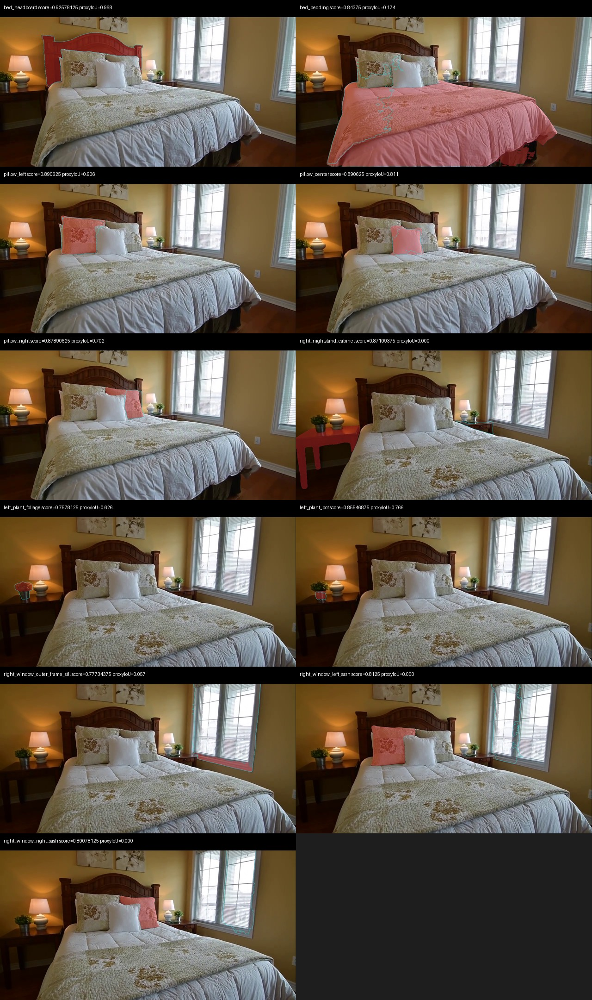
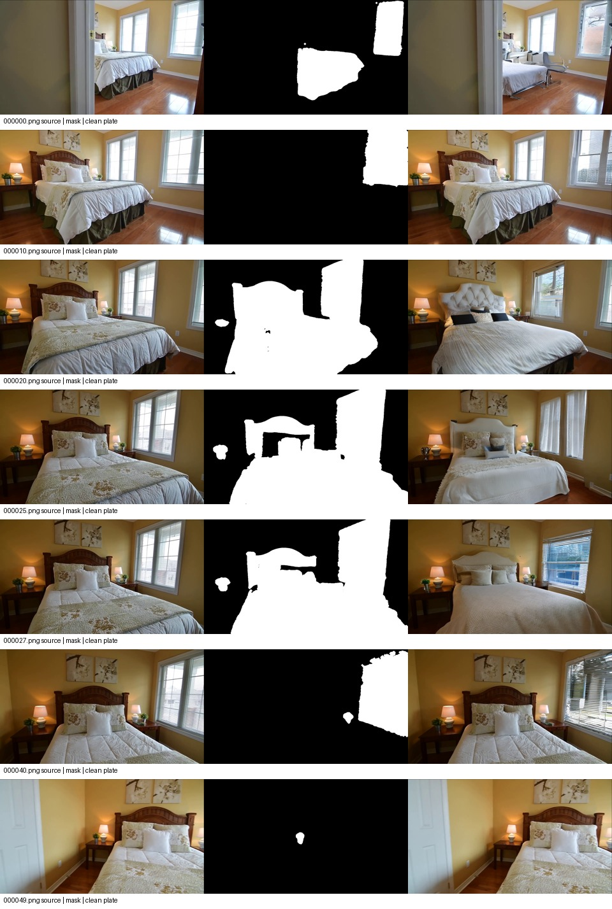
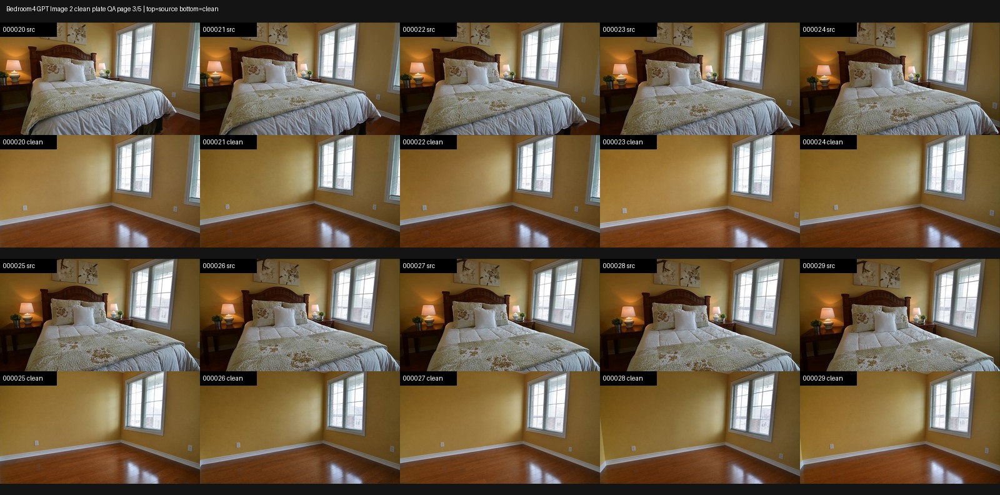
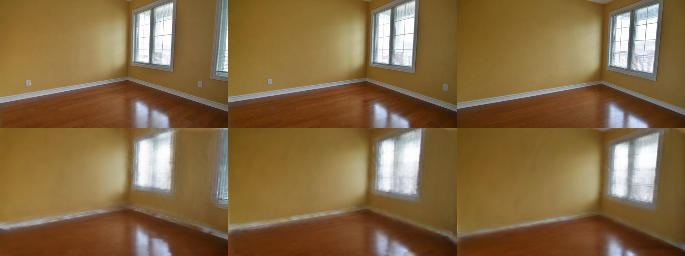
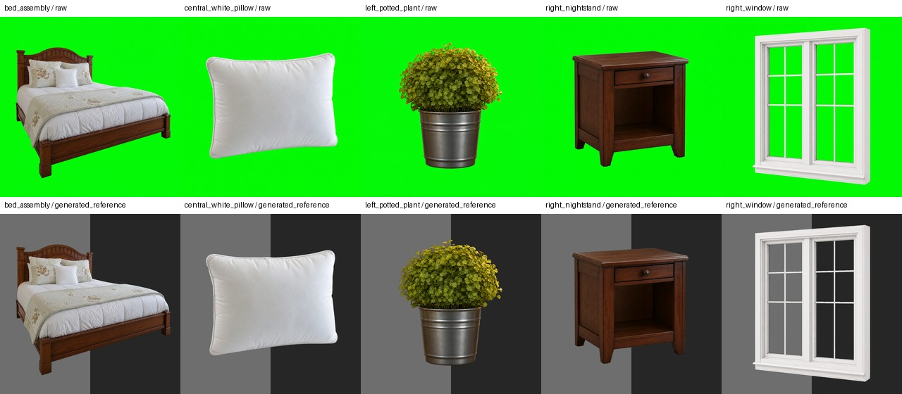
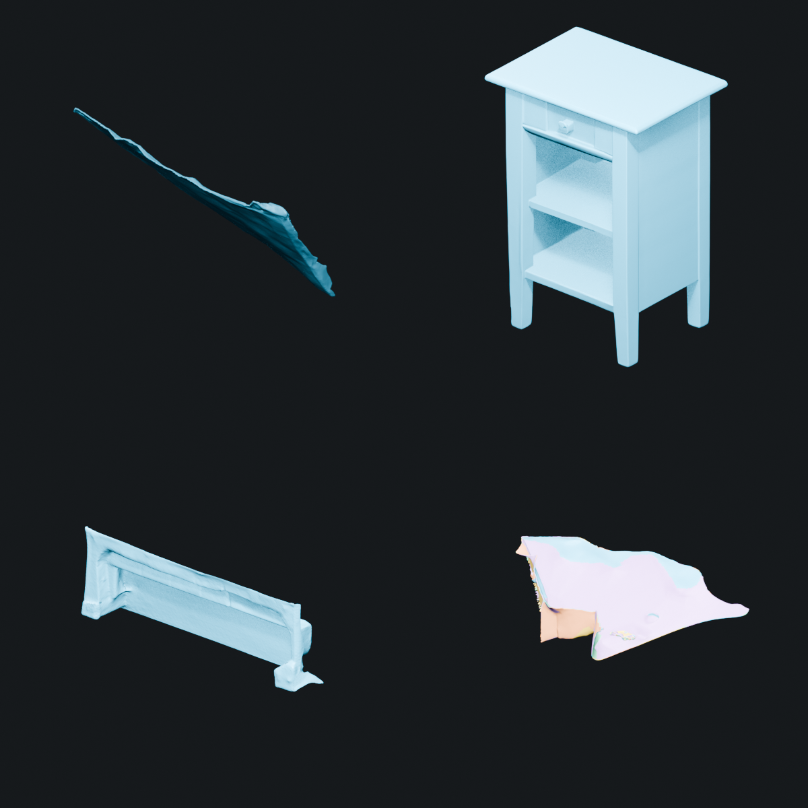
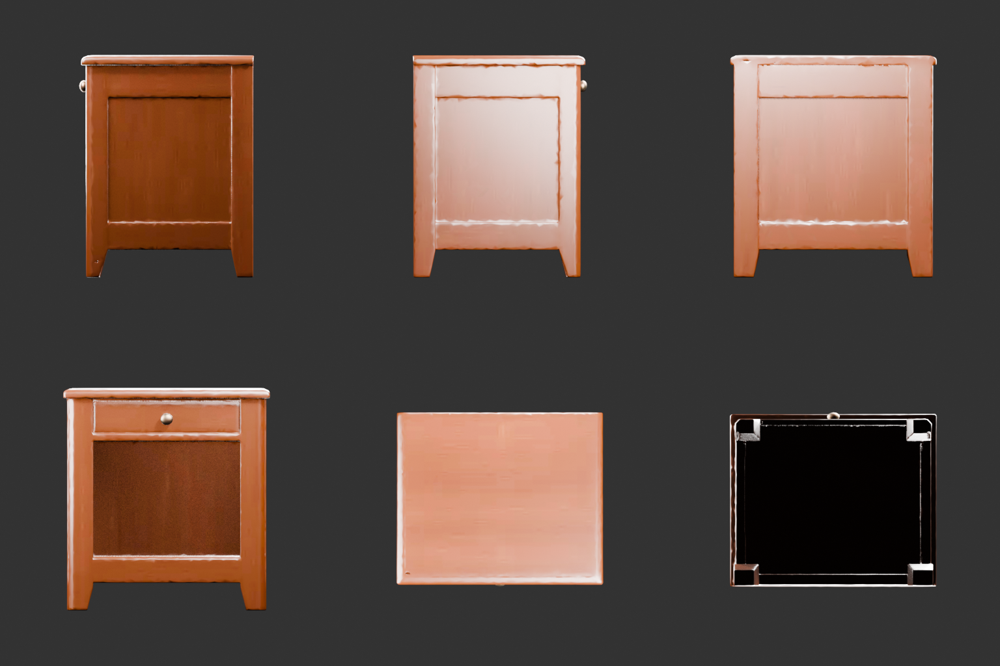
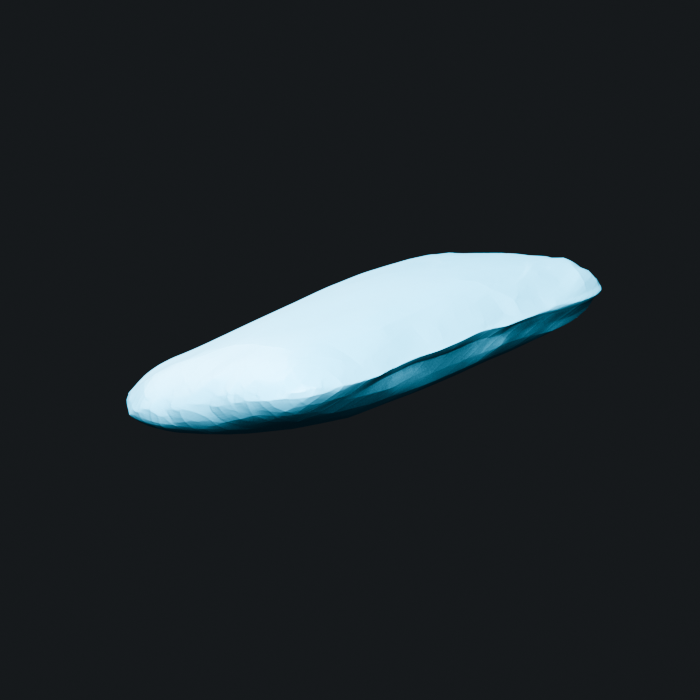
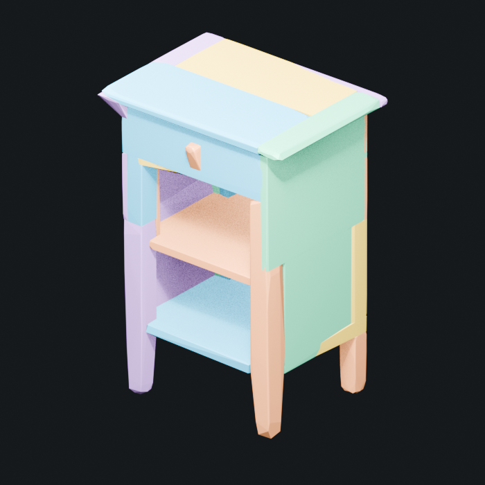
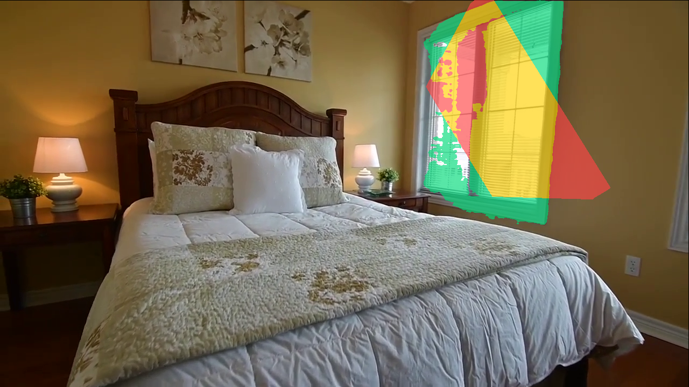

# Bedroom 4 的 Video2World vNext 建模全链实验（2026-08-02）

## 结论先行

这次实验把 vNext 从“代码合同”推进成了一次 `bedroom_4` 的 fresh cross-provider run，但**没有得到可以 canonical promotion 的完整世界**。

已闭合的部分包括原场景 DA3 prior、PGSR 30k、TSDF、GroundingDINO/Qwen proposal、结构化组件合同、SAM3-I simple query 与 SAM3 fallback、DA3 组件 lifting、50 帧 Responses GPT Image 2 clean plate、五对象生成参考、Stream3D/TRELLIS/TRELLIS2/SAM3D/Hunyuan3D 候选矩阵、3D-Fixer 几何、CoACD collider 和 Qwen-VL 物理先验。

没有闭合的关键门是：SAM3-I 组件批量只有 6/11 达到 proxy IoU 0.5；clean plate 是全帧生成而非固定像素修复；对象后端经常把单视图观测做成薄片；SAM3D 床头柜外观错误且没有 UV/PBR；Qwen-VL 的尺度/质量/摩擦没有公制校准；五个对象放回房间全部被人工视觉复核拒绝。因此本轮 `promotion_allowed=false`，bundle/Web 只能停在实验收据层。

远端隔离 run：

```text
/root/autodl-tmp/video2world-vnext-runs/
  bedroom4-fresh-vnext-20260802-130542
```

## 执行图

```text
50 RGB frames
 -> DA3 depth + 4M point prior
 -> PGSR 30k visual 3DGS + TSDF room mesh
 -> GroundingDINO proposals + Qwen component contracts
 -> SAM3-I simple query -> geometry gate -> SAM3 fallback
 -> DA3-depth observed component lifting
 -> component union (observed_union_not_amodal)
 -> Responses GPT Image 2 clean plate + fresh clean reconstruction
 -> Responses GPT Image 2 generated object references
 -> Stream3D / TRELLIS / TRELLIS2 / SAM3D / Hunyuan3D / 3D-Fixer
 -> simplify / UV-PBR audit / CoACD
 -> Qwen-VL unvalidated physics sidecar
 -> room placement and projection QA
 -> experiment receipt (promotion disabled)
```

这里没有把 DINOv3 写成 detector。DINOv3 是 feature encoder；本次出框使用 GroundingDINO，并由 Qwen-VL 负责 inventory、组件层次和提示词。这样保留了模型真实职责，也避免把特征编码误报成检测能力。

## 十六阶段状态

| Stage | 状态 | 本轮事实 |
|---|---|---|
| `ingest` | Passed | 使用当前 `bedroom_4` 50 帧，1280 x 720，frame order 固定。 |
| `da3` | Passed | fresh DA3 depth、相机对齐和 4,000,000 点 prior。 |
| `pgsr` | Passed | 原场景 PGSR 30k 与 fresh TSDF 均完成。 |
| `object_proposals` | Passed | fresh GroundingDINO proposals；DINOv3 不承担 box detector。 |
| `qwen_contracts` | Passed | Qwen 输出对象 inventory、组件、observed/completion-only 边界与生成提示。 |
| `component_segmentation` | Partial | SAM3-I 11/11 有输出，但只有 6/11 通过 proxy IoU 0.5；其余回退 SAM3。 |
| `semantic_lifting` | Passed observed-only | 116 个跨帧碎片被 lift；它们是未补全观测点云，不是完整对象。 |
| `clean_plate` | Partial | 50 帧 GPT Image 2 候选允许 fresh 3D 重建；全帧漂移禁止直接视觉晋升。 |
| `component_assembly` | Partial | 床、枕头、盆栽、床头柜、窗组件按 observed union 拼接；不补写隐藏面。 |
| `image_completion` | Partial | 五对象均生成参考；枕头和床头柜可用，其余存在身份或 alpha 限制。 |
| `object_completion` | Partial | 六类 backend 有真实产物，但没有一个床头柜候选同时通过几何、外观和房间对齐。 |
| `mesh_postprocess` | Partial | SAM3D 床头柜 CoACD 通过；PBR/UV 失败，3D-Fixer 仅几何通过。 |
| `physics_estimation` | Partial | 两个 Qwen-VL 模型完成 fresh 推理，只能保留 unvalidated priors。 |
| `placement` | Failed visual QA | 数值门 1/5 通过，人工视觉 0/5 通过。 |
| `bundle` | Blocked | placement、外观和物理门未闭合，不能生成 canonical world。 |
| `web` | Not tested for promotion | 没有可晋升 bundle，不进行伪 Web QA。 |

本轮 [hash-bound 十六阶段实验收据](https://github.com/Interstellar6/video2world/blob/codex/dev/docs/video2world/assets/modeling-vnext-20260802/experiment-receipt.json) 汇总为 6 个 `passed`、7 个 `partial`、1 个 `failed`、1 个 `blocked` 和 1 个 `not_tested`。收据逐项绑定本地证据文件；未同步到本地的原场景大资产只保留已核验的远端路径、拓扑和指标说明，不伪造本地 artifact。收据自身固定 `promotion_allowed=false`。

## 原场景：DA3、PGSR 与 TSDF

原始 50 帧使用同一组输入完成 fresh DA3 prior。`pointcloud_da3.ply` 为 4,000,000 点，SHA-256 为 `3595a1e1...`。PGSR 训练到 30,000 iteration，最终 L1 为 `0.0122393`、PSNR 为 `29.2201`；visual Gaussian PLY 有 836,362 个顶点。TSDF 输出有 1,837,796 vertices / 3,614,374 faces，是可读的非 watertight 房间表面，不是封闭碰撞体。

这三类资产角色保持分离：PGSR PLY 是视觉 3DGS，TSDF 是静态场景 mesh，DA3 点云是几何 prior。任何一个都不能替代另外两个。

## Qwen、SAM3-I 与组件 lifting

SAM3-I 使用用户提供的 Stage 3 checkpoint，官方源码固定到 commit `5656d47`，本地与远端 checkpoint SHA-256 一致。headboard simple query 得分 `0.890625`，对 fresh Qwen-box SAM3 proxy 的 IoU 为 `0.9569`；complex 指令错选了枕头，因此 complex 路由继续 fail closed。

11 个组件 simple query 全部返回 mask，平均 proxy IoU 为 `0.4556`，只有 6/11 达到 0.5。床头板、左右/中央枕头、植株叶片和花盆表现较好；床品、右床头柜与窗框/窗扇存在明显错分。canonical 路由因此是：

```text
SAM3-I simple
 -> proposal bbox / area / center / proxy-IoU geometry gates
 -> pass: use SAM3-I observed mask
 -> fail: use current SAM3 mask
```



经保守 mask 和 DA3 depth lifting 后得到 116 个跨帧实例碎片：bed 22、nightstand 8、pillow 8、plant 35、window 43。这里的“实例”是跨帧可见片段，不等于五个封闭对象。组件 assembly 只生成 `observed_union_not_amodal` 条件；Qwen 标注的隐藏床脚、背板等仍是 completion-only。

## GPT Image 2 clean plate

Clean plate 使用 Responses 协议，不调用 `/images/edits`：controller 为 `gpt-5.5`、reasoning effort 为 `xhigh`，图像工具模型为 `gpt-image-2`。50 帧中 47 帧是 fresh Responses 结果，3 帧是同批已验证 seed；全部规范化为 1280 x 720 RGB，原始 provider 输出保留。





人工复核允许这些图进入 fresh DA3/PGSR/TSDF 重建，但不允许直接替换 canonical visual。原因很具体：GPT Image 2 重绘了全帧，墙面、窗和地板只保持视觉连续，没有证明 mask 外像素不变或精确相机几何不变。新增墙面和地板也是生成假设，不是观测真值。

Clean DA3 已完成 50 张深度和新的 4M point cloud。Clean PGSR 训练到 30,000 iteration，最终 L1 为 `0.0524973`、PSNR 为 `20.4409`，输出 1,367,899 个 Gaussian，PLY SHA-256 为 `d01f37e1...`。Clean TSDF 有 705,640 vertices / 1,375,604 faces，SHA-256 为 `a8be876b...`。这些文件通过了尺寸、哈希和 PLY 拓扑检查，但 clean PGSR 比原场景低 `8.78 dB`，且源图存在全帧重绘；因此 clean scene 仍保持 `partial`，不会覆盖 canonical visual。



回渲染把数值差异变成了可见失败：模型确实生成了新的 Gaussian 与 TSDF，但没有保持足够清晰的跨视角几何和材质。因此这里的 `Partial` 指“fresh reconstruction 技术完成、visual promotion 拒绝”，不是未运行。

## 对象图生成与 3D backend 矩阵

组件 union 和 Qwen prompt 进入第二个 Responses batch，五个对象都得到 `generated_reference_not_observation` 图。所有 alpha 技术门通过，但人工复核只把中央白枕头和右床头柜标为较适合后续 image-to-3D 的参考；床、盆栽和窗存在身份或透明边界局限。



在相同右床头柜输入与 seed 1234 上进行了后端矩阵：

| Backend | 顶点 / 面 | Watertight | 视觉结论 |
|---|---:|---:|---|
| Hunyuan3D-2.1 | 68,804 / 140,836 | Yes | 技术可读，但只补出薄片。 |
| SAM3D | 437,200 / 874,400 | Yes | 形状完整，有柜体、台面、搁板和四腿；外观变成近白色。 |
| TRELLIS v1 | 89,808 / 179,626 | No | 几何仍是部分薄片，texture CUDA 209 失败。 |
| TRELLIS2 observed reference | 64,153 / 98,914 | No | PBR GLB 技术可读，但仍是观测薄片。 |
| TRELLIS2 generated reference + repair | 79,254 / 88,649 | No | 原始导出因 6 个退化面被拒；PBR-preserving LOD90k 修复通过，柜体完整但侧后纹理偏白。 |



生成参考图单独进入了一次 TRELLIS2。官方生成完成后输出 65,528 vertices / 96,858 faces 的 GLB，但 provider 因 6 个退化面触发 `no_degenerate_faces` 而 fail closed。后续 PBR-preserving repair/LOD90k 得到 79,254 vertices / 88,649 faces，退化面归零，保留 1 个 UV layer、1 个 PBR material 和 2 张 1024² texture，bounds drift 为 0。



这说明“生成完整图再 image-to-3D”确实比 observed-reference 薄片更接近完整柜体，但它仍是 `generated_reference_not_observation`。六轴只通过 object-space 形状与类别复核；侧后纹理、房间尺度、placement 和 runtime collision 未通过或未测试，因此不能倒推为观测恢复，也不能直接晋升。

## 3D-Fixer、simplify、UV/PBR 与 CoACD

3D-Fixer 在中央白枕头上完成 official core geometry：canonical 与 single-view-aligned GLB 都有 223,040 vertices / 446,072 faces 且 watertight，另输出 328,736 点 Gaussian。形状是合理枕头，但坐标仍是单视图 MoGe normalized scene，不是 Holi 房间坐标。



上游 Gaussian preview 曾尝试分配不合理的 `67,371,012.04 GiB` 而失败。新 adapter 只允许显式 `--skip-preview-render` 绕过这一预览，生成和 `to_glb` texture export 仍使用官方核心；占位 contact sheet 会标记为 `placeholder_not_visual_evidence`，不能拿来做视觉证明。

SAM3D 床头柜的 874,400 faces 几何经过简化得到 88,650 faces，bounds drift 仅 `6.72e-5`，但源文件 UV layers 为 0、texture images 为 0，因此 PBR QA 失败。该文件只能保留为几何候选。

同一 SAM3D 几何经过 CoACD 得到 32 个 watertight convex hull、3,790 faces 的独立 OBJ collider，object-space 技术和视觉检查通过；room runtime collision 未测试。

生成参考图的 TRELLIS2 候选还经过一次独立的 PBR-preserving repair/simplify。它修复了 6 个退化面并保持 UV、PBR material、texture、normal 和 bounds，但这只关闭了 mesh technical gate；纹理与房间对齐门仍保持打开。该 repaired GLB 将与独立 CoACD collider 走 `layered_visual_and_collider` 合同，而不会把视觉 mesh 自身误写成 convex collision volume。



## Qwen-VL 物理参数

Qwen2.5-VL-3B 与 HoliSpatial-2M-QA-Qwen3-VL-8B 都完成 fresh 五对象推理，并输出尺寸、质量、静/动摩擦和恢复系数。8B 的床与床头柜质量更合理，但窗深度 1.0 m、枕头高度 0.5 m、盆栽过小，轴约定也不稳定。

因此所有结果固定为 `unvalidated_estimate`，`runtime_dynamics_allowed=false`。右床头柜可作为后续标定候选，不能直接写进模拟器。新的 `PhysicalProperties` 合同要求 calibrated/validated 状态绑定公制或测量证据的 URI、SHA-256 和字节数；VLM/category prior 不允许升级。

## 放回房间：数值通过不覆盖人工拒绝

Stream3D official pose 与 DA3 相机用于五对象回投。数值门只有 window 通过，bed、pillow、plant、nightstand 均失败；人工视觉复核则 0/5 通过。window 的 aggregate mask/bbox 数值虽然过线，凸包包含横跨墙体的大面积误三角形，必须拒绝。



这一步证明“输出了 world-baked GLB”与“物体被正确放回房间”是两件事。没有通过 source-camera silhouette、support、interpenetration、collision 和 visual QA 的对象不能进入 bundle。

## 代码合同

本轮在 `codex/dev` 实现并验证了以下核心边界：

- canonical fusion 显式接收 `depth_manifest` 和 `point_prior`；
- `modeling_vnext` 十六阶段 DAG、provider profile 与 typed semantic manifests；
- SAM3-I simple + geometry gate + SAM3 fallback；
- Responses GPT Image 2 clean plate 和对象参考 batch runner，密钥不落盘；
- Stream3D/TRELLIS/TRELLIS2/SAM3D/Hunyuan3D/3D-Fixer 路由事实边界；
- `layered_visual_and_collider`、独立 CoACD topology 和 physics sidecar；
- Qwen-VL 物理估计、CoACD、六轴 GLB 与 collider render 工具；
- hash-bound 十六阶段 experiment receipt，固定 `promotion_allowed=false`；
- VGGT-Omega 到 Holi/PGSR 兼容 prior 的独立 A/B driver，兼容目录仍叫 `depth_da3`，receipt 明确声明实际 backend，禁止混淆来源。

本地验证为 Python 全量 1,073 tests passed、Web 141 tests passed、Web production build passed、聚焦 Ruff 与 `git diff --check` passed。构建只保留既有 Spark/Three chunk size warning。Web 初次并发复跑时有一个旧 promotion 用例触发 5 秒超时；该用例单独复跑 1.18 秒通过，随后默认全量 141/141 通过，未将瞬时超时隐藏为首轮成功。

## 最终边界

本轮证明的是：vNext 的关键 provider 可以在一台 3090 节点上串联，并且代码合同能保存真实失败；它没有证明已经得到可交互、可碰撞、物理可信的完整 bedroom world。

要升级为 canonical world，至少还需要：稳定的组件跨帧身份；不改 mask 外像素且相机一致的 clean plate；同时通过形状、PBR、六视图和房间投影的对象；公制尺度与物理标定；独立 collider 的 runtime probe；最终 bundle 的桌面/移动 Web 视觉与交互 QA。

架构和字段定义见 [Video2World vNext 物体建模合同](../project-docs/modeling-vnext.md)。
