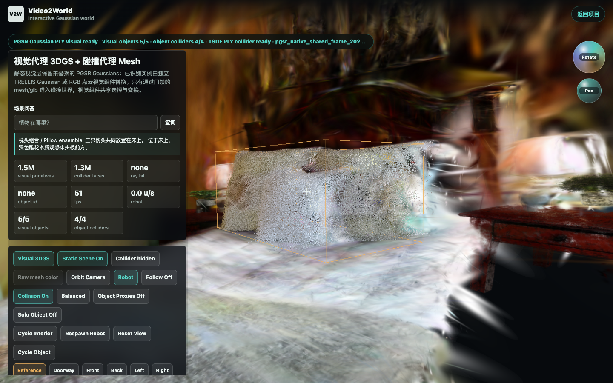

# 进展与实测

- [bedroom_4 真实资产与门禁记录（2026-07-16）](bedroom4-20260716.md)

当前完成了独立仓库、10-stage DAG、强类型 manifest、离线中英 scene query、Qwen2.5-VL-3B evidence caption、Web GLB/BVH/object-group runtime 与 pillow SAM3 delta。bedroom_4 production 大资产浏览器 QA 已通过；准确计数、交互、性能、截图及 visual-only 枕头边界见实测记录。
