# 通用遮挡、背面与背景分层补全

Video2World 的补全对象不是某一种家具，也不是对一张图做一次 inpainting。系统把问题拆成三条必须分别验收的链：独立物体的不可见表面、物体放回场景后的几何关系、移除物体后暴露的背景。只有三条链都通过，才允许用新对象替换静态场景中的原对象。

```text
对象证据 -> mesh-first PBR GLB（对象 Gaussian/point cloud 可选）
         -> scene fit + support + interpenetration
         -> clean plate RGB -> 新 depth/normal -> clean scene Gaussian / mesh
         -> 下一遮挡层重新盘点
```

对象六视图通过，不代表场景通过；scene-space OBB 拟合通过，也不代表背景已经修好；2D inpainting 能输出完整帧，也不代表被遮挡的床面、墙面或地面被真实恢复。这些边界由 `video2world/completion.py`、`video2world/completion_routing.py` 和各阶段 receipt 固化。

## 三种证据状态

每个像素、点、表面和资产都必须能回答“它从哪里来”。

| 状态 | 定义 | 典型内容 | 可以声称什么 |
|---|---|---|---|
| `observed` | 原视频中直接可见，并绑定 frame、mask、相机与 hash | RGB 像素、SAM3 可见 mask、可见轮廓、直接深度证据 | 该视角确实观察到颜色、材质或几何边界 |
| `reconstructed` | 由已标定的 observed 证据确定性求解 | 多视角点云、AABB/OBB、TSDF、重投影 donor、scene fit | 结果由哪些观测和算法推导得到 |
| `generated` | 没有直接观测，由类别、检索或生成先验提出 | 物体背面、长期遮挡区域的纹理、clean-plate residual | 这是受证据约束的候选，不是物理真值 |

相邻视角 donor 像素仍保留原始 frame provenance，但其投影位置和可见性判断属于 reconstructed。类别先验可以提供闭合拓扑，却不能把先验颜色冒充 observed albedo。生成背景必须单独标记，并在生成之后重新估计 depth/normal；不能复用含前景物体的旧深度。

## 为什么必须从前向后逐层处理

场景 inventory 先找主要对象、附属对象、fixture 和结构，再由 SAM3、标定相机与 depth 建立遮挡有向图。边 `A -> B` 表示 A 位于 B 前面，必须先处理 A，才能判断 B 是否完整。置信边存在环时计划直接失败，不能猜一个处理顺序。

Inventory 同时决定 semantic granularity。可独立移动但依附于大对象的实例使用 `independent_child_asset`：父对象移动时 child 跟随，child 自己旋转时不反向带动 parent。床板、床单、床腿等不可独立操作的部分使用 `merge_into_parent`；墙、地面和天花板使用 `structure_background`。这个层级决定 completion target、scene command 的 split/merge/reparent 行为和 Web transform，不只是显示标签。

Qwen scene audit 只负责类别、可见数量、可见颜色/形状/材质和可能的父类。它明确禁止输出 bbox、mask、稳定 instance ID、深度顺序、遮挡边和隐藏几何；这些仍由 SAM3 与标定几何决定。当前 bedroom_4 的 official 7B per-view run 已做到 8/8 严格解析并合并出 7 类 observation；这些结果仍只是 inventory 观察，不会自动升级成 geometry-verified 遮挡边。VLM 输出能“看起来合理”不等于几何合同通过。

默认 `max_parallel_targets_per_round=1`。这是为了避免同一层相邻对象被同时移除后失去 donor、支撑和遮挡归因。一个 round 只消费紧邻的上一轮 clean plate；前一轮不是 `passed`，更深层不能开始。

## 每一轮的输入、输出与依赖

第 0 轮输入是原始 RGB/cameras/depth、scene Gaussian/mesh、SAM3 evidence、对象点云和 scene inventory。之后第 N 轮始终消费第 N-1 轮通过的 clean plate 与重新盘点结果。

| 顺序 | 动作 | 直接输入 | 主要输出 | 阻断门禁 | 下一步 |
|---:|---|---|---|---|---|
| 1 | `reinspect` / 选择最前层 | 上轮 clean plate、scene audit、SAM3、depth | inventory、occlusion graph、target ID | instance identity、图无环 | instance split |
| 2 | `split_instances` / `segment` | 原帧、类别、prompt、上一轮 inventory | 每实例跨帧 masks、证据 frame | mask provenance、同物理实例 | 3D lift |
| 3 | `lift_to_3d` | masks、cameras、depth | object cloud、AABB/OBB、可见面比例 | 多视角投影、depth consistency | appearance contract |
| 4 | appearance contract | 至少两个原视频视角、source RGBA | 颜色/材质/形状/部件布局合同 | 跨帧身份和外观一致 | backend routing |
| 5 | `complete_object` | 合同、可见几何、类别、检索或生成条件 | PBR GLB/mesh、可选 object Gaussian、completion report | 背面非空、六视图、外观、mesh 技术 gate | geometry review |
| 6 | geometry review | source、front render、material、六视图、mesh report | accept/retry/reject、详细 retry prompt | 技术 gate + VLM review | scene fit 或重试 |
| 7 | `place_object` | accepted canonical asset、scene OBB、支撑面 | scene-fit unified GLB 或旧模式多表示、transform、pivot | alignment、support、interpenetration | clean plate |
| 8 | `clean_plate` | 原/上轮 RGB、removal masks、donor views、scene geometry | clean RGB、residual masks、clean-plate manifest | outside unchanged、跨视图、背景语义 | depth/normal rebuild |
| 9 | 重建局部场景 | accepted clean RGB、cameras | 新 depth/normal、clean scene Gaussian/mesh | 背景 depth/normal、static carve | 再盘点 |
| 10 | `validate_round` | 本轮所有 receipt | round quality report、下一轮输入 | 所有 gate 通过 | 下一遮挡层 |

所有前景对象完成后才进入 `final_background`。该轮只重建墙、地面、天花板与剩余结构，不再产出独立对象。计划的停止条件是：没有未建模的主要/次要对象；每个既有 round 的 mask 外区域和跨视图门禁通过；只剩结构背景。

## 后端不是按类别硬编码

`completion_routing.py` 先验证同物理实例和外观合同，再按直接证据强度选择后端。下表分数是当前确定性路由优先级，不是生成质量分数。

| 后端 | 当前优先级 | 进入条件 | 适用边界 |
|---|---:|---|---|
| `support_surface_reconstruction` | 98 | 结构背景且有经过验证的 plane/depth/normal | 先重建床面、墙面、地面等支撑，只生成残余洞 |
| `multi_view_reconstruction` | 96 | 同实例与外观通过；至少 3 个标定视角；baseline `>=0.05`；可见表面 `>=0.35` | 直接几何证据优先 |
| `deformable_category_prior` | 88 | source front RGBA 可用；类别有柔性闭合体 profile | 枕垫、软包等；先验只提供拓扑 |
| `retrieval_cad_prior` | 82 | 刚体类别且 CAD confidence `>=0.82` | 桌、椅、柜、灯等规则物体 |
| `generative_image_to_3d` | 70 | 同实例、外观与 source RGBA 均通过 | 没有更强几何或检索证据时的候选 |
| `hold_for_more_evidence` | fail closed | 身份或外观未验证，或所有候选被审核拒绝 | 不生成、不发布 |

即使类别是已注册的柔性物体，如果跨帧颜色和物理实例不一致，也必须选择 hold。bedroom_4 的第二批三对象 RGBA 就因为“单帧外观合同与用户确认的浅色/白色场景外观存在冲突”在 generation 前被拒绝，没有送入 TRELLIS。

只要 `persistent_occlusion_fraction > 0`，背景残余策略就是 `multi_view_donor_then_constrained_generation`；比例达到 `0.80` 以上时 receipt 还必须显式提醒“多数隐藏像素没有 observed donor”。这不会自动批准生成，只是规定 donor 与 generated residual 的顺序。

## 独立对象默认交付：一个 PBR GLB

独立对象采用 mesh-first 合同。只要 PBR GLB 的整体形状、主色类别、可见面外观和场景放置可接受，它本身就同时承担三种责任：Three.js PBR 可见表面、select/drag/spin 的逻辑主体，以及机器人 MeshBVH 接触表面。对象 Gaussian、对象 point cloud、单独 `renderAsset` 和单独 collider proxy 都不是必需产物；对象点云仍可作为扫描 evidence，场景整体仍保留 PGSR 3DGS 与 TSDF，但不要求把每个生成对象再复制成 Gaussian 视觉代理。

Web 投影用 `collision.mode=unified-glb` 显式声明该模式。同一 GLB 只加载一次，manifest 不得同时声明 `visual`、`collision.renderAsset` 或 `colliderProxy`，加载或技术 gate 失败时直接阻断该对象，不回退到 box。碰撞拓扑分为：

| topology | 必须满足 | 允许声称 |
|---|---|---|
| `surface_bvh` | mesh 非空；vertices/indices finite；无退化三角面；winding consistent；1-100,000 faces；collision gate 与 `surfaceCollision` 均 passed | 机器人和射线的表面阻挡；不声称 watertight、体积或 inside/outside |
| `closed_volume` | `surface_bvh` 全部条件，加上 `watertight=true` | 表面阻挡与闭合体语义；更高层物理仍要单独验证 |

旧 production 中 Gaussian visual、render mesh 和 simplified collider 分开的模式继续作为历史兼容合同保留，但不是新对象的默认输出，也不能据此要求新的 object Gaussian/point cloud。

## 官方 TRELLIS.2 provider 合同

通用 image-to-3D 路径由 `python -m video2world.providers.trellis2_asset` 执行单对象生成。它默认只接受带真实 alpha 的 RGBA，避免对已经由 SAM3/appearance contract 确认的轮廓再次做隐式 RMBG；RGB 或不透明输入只有显式 `--allow-rmbg` 才能进入模型。默认 production 输出是一个必需的 `asset_pbr.glb`，processed input 与 hash receipt 用于审计；raw mesh、点云和 convex 仅为 debug opt-in。

这不是根据文档猜出的 wrapper。2026-07-17 mil8 实际跑通并复核的官方代码是 `https://github.com/microsoft/TRELLIS.2.git` commit `75fbf0183001ed9876c8dbb35de6b68552ee08bd`，模型是 `microsoft/TRELLIS.2-4B` revision `af44b45f2e35a493886929c6d786e563ec68364d`，现场 `pipeline_512.json` SHA-256 为 `308dd782f3eaf1e30e7403ee3837f21beefa664202b0a045ca61308a42c661b3`。provider 直接调用官方 `Trellis2ImageTo3DPipeline.run` 和 `o_voxel.postprocess.to_glb`，decimation target 被限制在 `1..100000` faces。

最终审计不相信导出函数的返回值，而是重新解析 `asset_pbr.glb`：所有 node transform 和 vertices 必须 finite，faces 必须是有效整数三角索引且没有退化面，winding 必须 consistent，每个 mesh 都要有 PBR material，整体 extents 为正且总面数不超过本次 target。每个材质 receipt 记录 normalized base-color factor、`metallicFactor`、`roughnessFactor`、baseColorTexture 是否存在及其 image mode/尺寸/decoded-pixel hash/数值范围、alpha mode/cutoff/texture channel 和 double-sided。factor、cutoff 与解码纹理数值必须 finite 且位于 `[0,1]`，alpha mode 与 double-sided 类型也必须合法。watertight 才能标记 `closed_volume`；否则技术通过的对象只能标记 `surface_bvh`，可以承担表面接触但不能声称体积或 inside/outside。任一技术 gate 失败都会落失败 receipt 并终止；通过也只得到 `technical_passed_visual_pending`。

材质参数的技术合法性与物体语义分开。`metallicFactor=1` 对金属对象可能正确，因此通用 provider 不把它设为失败条件；scene-fit material profile/VLM 再依据对象类别、原视频主色与材质证据决定是否修正。明显 shape mismatch、主色类别错误和显著 interpenetration 仍是 hard gates；轻微不可见面纹理或材质 hallucination 保持 warning，可记录 limitation 后放行。

receipt 固定记录 source commit、model revision、config hash、seed、输入 RGBA hash、最终 GLB hash、debug flags、运行时和完整 mesh audit。随后必须运行 `scripts/capture_object_review.mjs`，从 canonical `object-review` 页面取得 `front/right/back/left/top/bottom` 六个正交 object-local render、3x2 contact sheet 及逐文件 hash receipt。旧 wrapper 的水平 orbit 只能作动画预览，不能替代 top/bottom 与正交侧面证据。

## 六视图与语义 albedo

每个独立对象都必须检查 `front/right/back/left/top/bottom`。只看 front 会漏掉片状点云、空背面、错误厚度、侧面贴图拉伸和断开的部件。

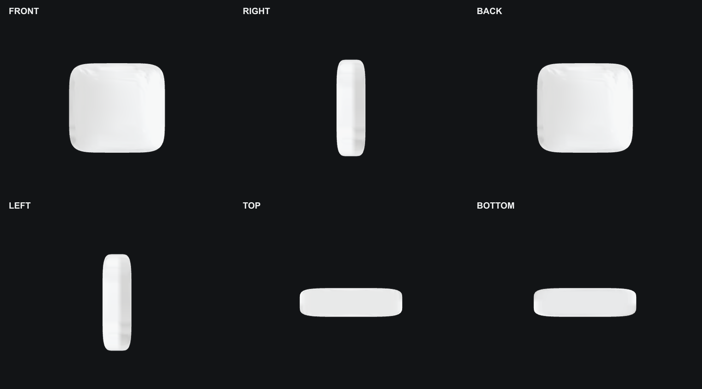

审核分两层：

1. 确定性技术 gate 检查 finite geometry、非空 mesh、正 extents、front aspect、厚度比例、source/front/material 色差和六视图非空；`surface_bvh` 不把 watertight 当作必要条件。
2. VLM 同时读取原始 source、透明背景 front render、material reference、六视图和技术报告，检查 identity drift、缺背面、开洞、颜色/材质/形状变化、部件丢失或合并、漂浮/断开和跨视图风格不一致，并按影响程度分级。

审核是 severity-aware，而不是“出现任何生成痕迹就失败”。轻微背面纹理、不可见面花纹或材质细节幻觉，如果不改变整体形状、主色类别、可见面身份且不造成明显穿模，可以写成 `passed_with_recorded_limitations`；当前 `GateRecord` 的落盘方式是 `status=passed` 并在 `reason`/limitation 或 report 中保存具体偏差。明显形变、主色类别错误、缺面/片状、部件断裂、悬空或显著穿模仍是 blocking issue，必须 retry/reject。所有限制保留 provenance，不能因为人工放行而删除失败观察。

“白色物体”必须在原视频的多个曝光条件下建立浅色语义合同，再在 neutral-albedo mesh 和 Gaussian direct-color 中检查。不能因为场景灯光偏黄就生成棕色背面，也不能仅用平均 RGB 把花纹物体强制涂白。当前 front 对象实验使用的样例阈值是 luminance `>=160`、chroma `<=35`、mean-RGB error `<=45`；这些是本次 receipt 的检查参数，不是适用于所有视频的固定全局阈值。

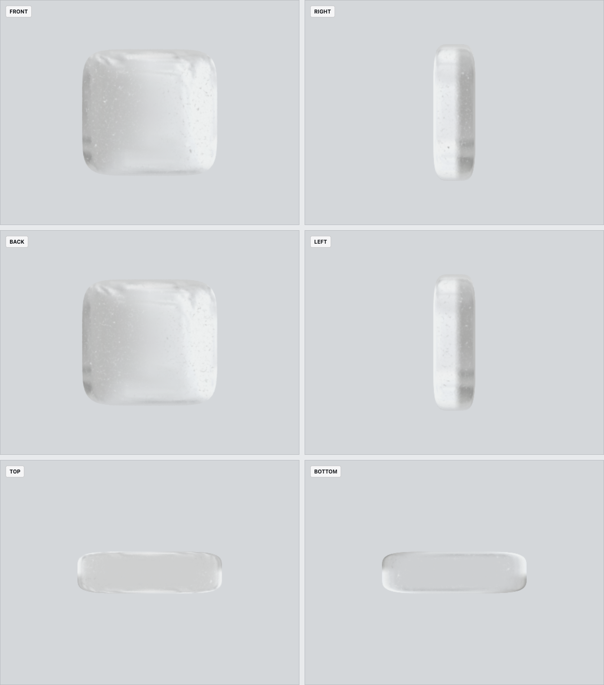

旧 parametric 实验中，浅色 front 对象的 Gaussian mean RGB 为约 `210.1 / 211.7 / 212.5`，六视图均非空，thickness/max-extent 为 `0.28085`；对应 mesh 为 10,226 vertices / 20,448 faces、单连通、watertight。它保留为多表示路线的历史证据，不再构成“必须生成 object Gaussian”的要求。

当前 mesh-first 候选来自真实 TRELLIS2 front pillow seed 42。`asset_pbr.glb` 有 60,237 vertices / 97,082 faces、一个 PBR material，finite、无退化面、winding consistent，但不是 watertight；六视图显示完整厚度，不再是只有正面的片状对象。它因此只能使用 `surface_bvh`，不能声称 closed volume。不可见背面的花纹与扫描正面不完全一致，按用户最新验收口径属于可记录的 minor hallucination：整体枕头形状和浅色主色类别保持可接受，可用 `status=passed + limitation` 放行 object-local gate。

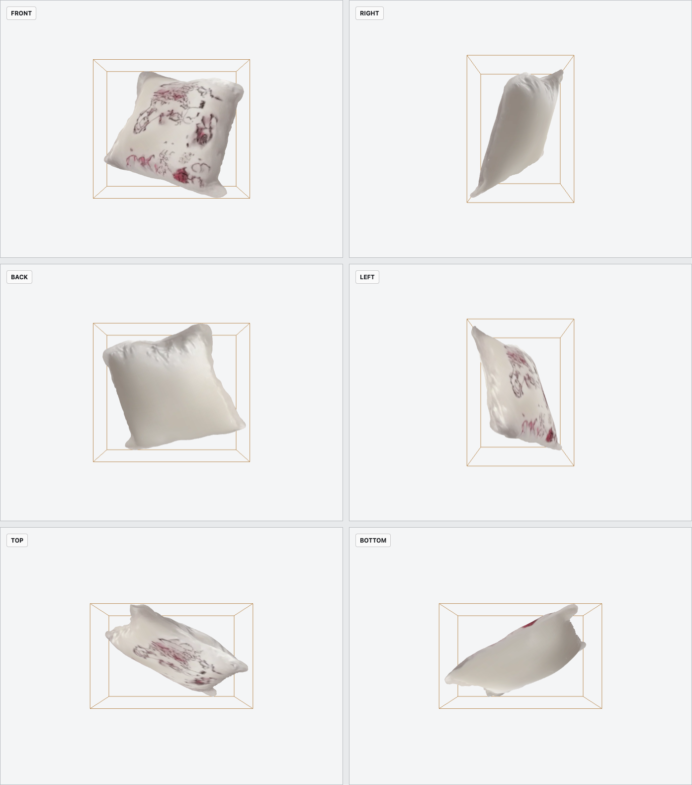

早期 image-to-3D 候选因 `front_color_fidelity=false` 和 `missing_back_surface` 被判定 `retry`，没有因为文件能打开而放行。这正是六视图合同要消除的错误。

## VLM 审核与最多三次尝试

当前 production 策略将每个对象的 `max_attempts` 固定为 3：

1. 第一次生成后先跑技术 gate，再跑 VLM geometry review。
2. 只有明显形变、主色类别错误、缺面/片状、部件断裂、悬空、显著穿模或失败的硬技术 gate 才触发 `retry/reject`；轻微背面纹理或材质幻觉写入 limitation 后可以通过。
3. `retry` 必须至少包含一个 blocking issue 或失败的技术 gate，并生成面向下一次的具体 prompt。例如指出缺失哪个面、哪一视图主色错误、需要怎样恢复厚度或连接部件。
4. 下一次必须使用新 seed/prompt，并记录 prompt、输出资产和 review SHA-256。尝试编号严格连续。
5. 第三次仍是 `retry` 时状态变为 `exhausted`，对象保持 candidate/held；不能继续无限抽 seed，也不能进入 placement。

Schema 为研究运行保留更高上限，但 Video2World 当前发布口径不允许通过提高次数绕过三次审核预算。`accept` 后不允许再追加尝试；`reject` 是终止状态。

## Scene fit、支撑与穿模

object-local 资产通过后，`place_object` 才把 canonical bounds 拟合到扫描 OBB。unified 模式把变换直接烘焙到同一个 PBR GLB，并以 scene-space pivot 驱动选择、旋转和 BVH；旧多表示模式才需要把同一个变换分别应用到 Gaussian centers/covariance、render mesh 和 collider。

放置至少检查：

- OBB projected extents 与扫描目标一致，transform finite 且 determinant 为正；
- 对象与 bed/table/floor 等支撑面有合理接触，不能悬空，也不能把柔软对象压进支撑体；
- 对象之间、对象与静态 scene mesh 之间没有不可接受的三角面相交；
- unified GLB 的 surface/volume topology 与 collision gate 明确通过；旧模式 collider 仍需独立审核；
- 场景 overlay 中没有旧静态对象和新对象重影。

单视角或可见表面点云不能直接把 PCA OBB center 当作完整体积中心。`observed_front_surface` placement 必须显式提供原相机方向、厚度轴、类别厚度上限和 source-mask-derived in-plane scale；完整体积只能向遮挡侧扩展，原可见前表面保持锚定。真正有多视角体积证据时才使用 `volume_center`。

完成后还要把 scene-fit mesh 投回原视频相机，与原 SAM3 mask 比较 silhouette、bbox 和中心。PGSR camera rotation 的第二轴在当前归档中是 image-down；该约定必须写入 receipt，不能按常见 camera-up 猜测。

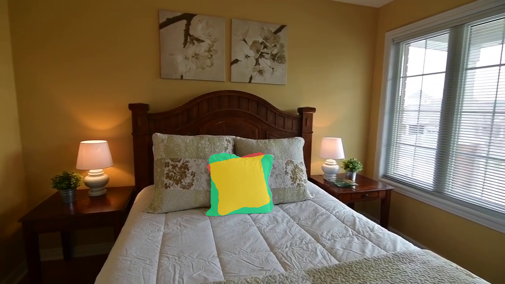

旧 parametric front 对象经历了三次保留证据的 placement 尝试，Attempt 3 得到 mask IoU `0.8026`、bbox IoU `0.9104`、中心误差 `4.75 px`。当前 TRELLIS2 PBR GLB 复用同一前表面锚定与 source-mask 尺度约束，真实回投结果为 mask IoU `0.709810`、bbox IoU `0.924577`、中心误差 `4.402 px`，三项 source-camera silhouette gate 均通过。

source-camera 回投本身仍不等于 unified browser scene pass，更不等于 PBR render 可以作为 clean-plate 遮挡层真值。旧 parametric Attempt 3 的 browser receipt 中 `scene <-> sam3_pillow_front` 有一组相交，五个 support offset 全为负，旧静态层从对象左半部和内部明显透出；这段失败证据继续保留。2026-07-17 的四对象 Web 运行曾完成 `current_demo_only` promotion，但它现在只作为历史交互与加载证据保留，不会反向把旧 Attempt 3、旧 R1-R4 或 R4 背景改写成高质量补全。

## Clean plate：先找真实 donor，再生成残余洞

clean plate 不是把物体 mask 直接交给视频 inpainting。通用顺序是：

1. 在 donor 视角排除目标和其他前景 mask；
2. 用 donor RGB-D 与标定相机投到 target；
3. 用 z-buffer、depth cluster、遮挡和最小 donor support 拒绝错误颜色；
4. 只把通过的 donor 写入 removal mask，mask 外保持 byte-identical；
5. 对剩余无观测区域使用 geometry-conditioned generation，并标为 generated；
6. 跨标定视角检查纹理、边界和结构连续性；
7. RGB 通过后重新估计 depth/normal，再重建 PGSR/TSDF。

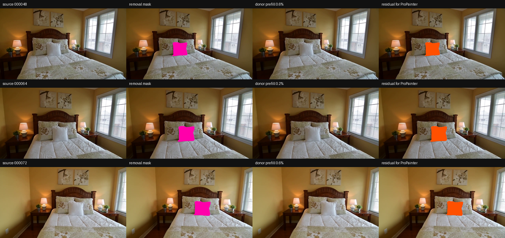

旧实验把 donor 帧中所有 `pillow` detection 按类别取 union 后统一排除。该 all-pillow control 在三个代表帧只得到 113/18,346、40/23,065、127/21,440，也就是 `0.62% / 0.17% / 0.59%`；它过度排除了本轮仍应保留的 left/right pillow，不是正确的 physical-instance 合同。把 foreground exclusion margin 降到 0 后 coverage 虽看似升到约 9.86%-11.89%，support 却只形成原物体边缘的一圈浅色泄漏：

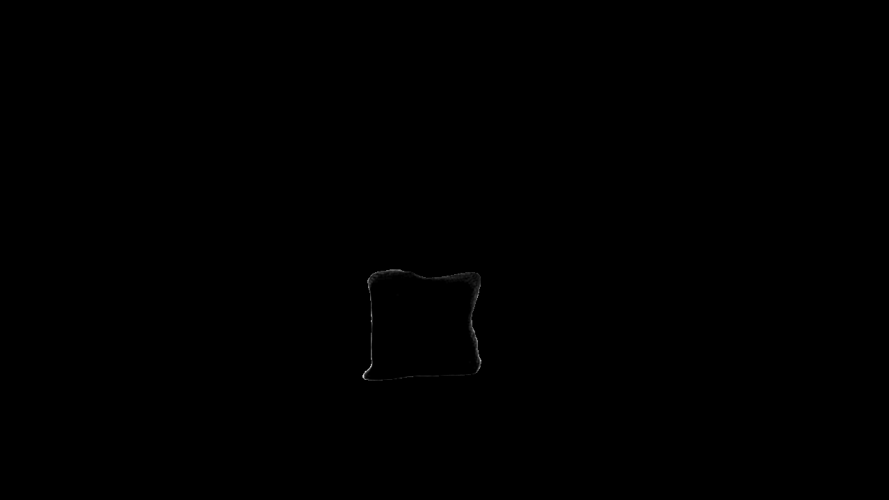

corrected 审计先用三个显式 3D anchor 在原始 80 帧上建立 physical identity，不读取 SAM3 文件名、逐帧 ordinal 或 detection 顺序。association 状态为 `passed`：front/left/right 分别有 79/73/80 个 high-confidence assignments；frame `000000` 没有可靠 front assignment，因此从 front donor pool 排除，而不是把缺失 mask 当作安全空 mask。association report SHA-256 为 `049689c7c967ccd24aacf10cf90efe6323944f3a2c33cef77b436509ff068cdb`。

在相同 source RGB、R1 core、相机、DA3 depth 和 fusion 参数下，只排除 physical `sam3_pillow_front` 后，25 帧 diagnostic coverage 从 all-pillow control 的 1,320/532,888（`0.2477%`）升到 21,717/532,888（`4.0753%`），提升 `16.45x`。但这些像素的 `96.14%` 位于 core 边界 8px 内；深内部仅覆盖 839/418,506（`0.2005%`）。因此 audit verdict 是 `boundary_constraint_only_not_clean_plate_fill`、`promotion_approved=false`，不能声称已经用多视角恢复了隐藏床面。audit report SHA-256 为 `86c8f5ec2ec8d0fce90f931fab2490021523455ca18cbe1f88a58bda37823d7c`。

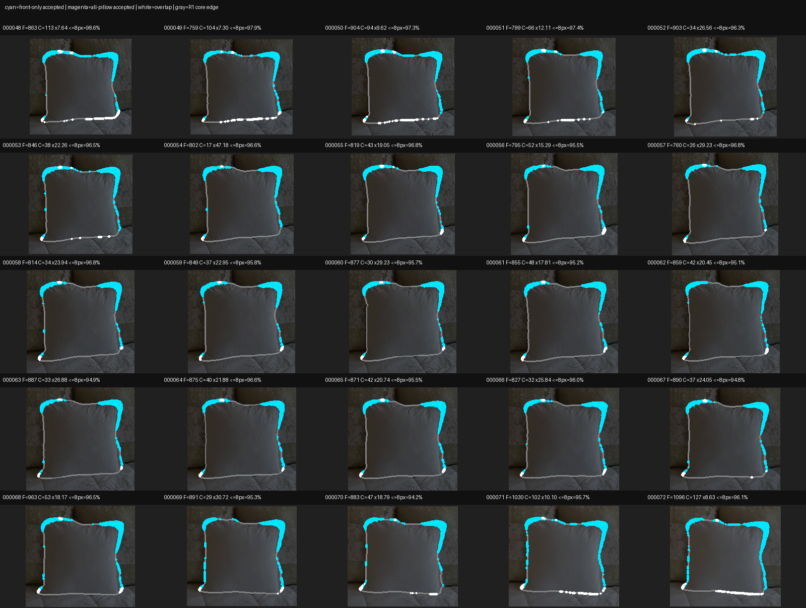

生产合同还要用更大的 foreground exclusion 作为 boundary guard 复算 support。frame `000064` 在配置 dilation 下出现 256 个候选 support；8px guard 后 stable support 为 0，最终 measured coverage 为 0/23,065，residual 保持 23,065。严格报告因此为 `technical_failed`、`promotion_approved=false`，失败项是 `donor_support_not_boundary_concentrated=false`。本次 corrected manifest SHA-256 为 `7ad7ed45c46ffda1234bf3982e362233e900680e60c18546cfef34838e9a955f`，strict report SHA-256 为 `410eb5be0805458ee6d16b713832e26d93e5d50f83833c1461e7e6fea62a3a34`，raw associated-index receipt SHA-256 为 `62fc0b386998b95043806141f767285da5202fb889b99b9cf913ebd825574f4c`。

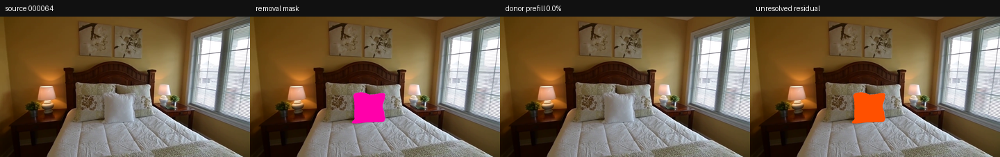

历史 full-mask ProPainter 虽通过 25/25 帧、尺寸、mask 外 RGB 和输出非空等技术检查，视觉上仍是灰白低频光斑。固定 revision 的 SDXL seed `2026071701` 曾由用户以 `pass_with_known_limitation` 放行旧 bedroom4 demo 和独立对象集成 QA；该单帧候选处理 20,791 个 mask 像素且 mask 外 changed pixels 为 0，但移除区仍有枕头状生成。这项决定只是一条 archived demo exception，不证明 object-free clean plate、跨视图一致性或被遮挡几何已经恢复。

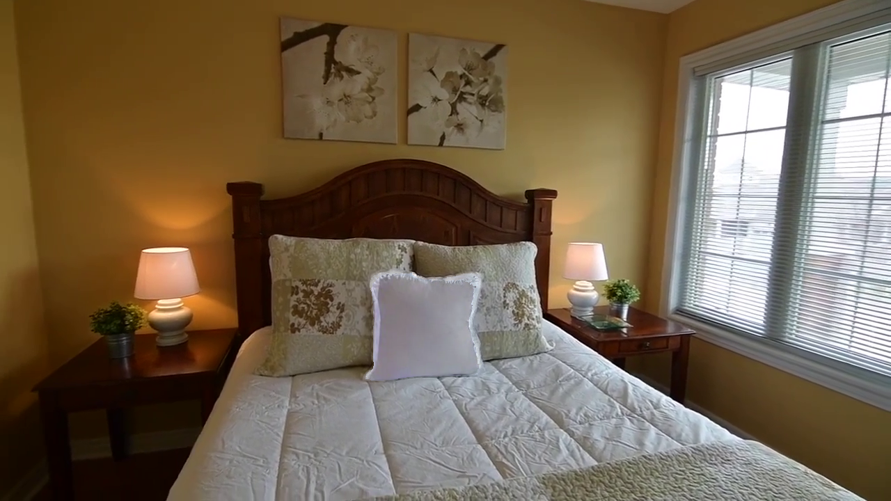

## 逐层 Clean Plate 的规范合同

规范顺序固定为 `sam3_pillow_front -> sam3_pillow_left -> sam3_pillow_right -> sam3_bed_01 -> structural background`。**R1 必须输入原始 RGB，R2 必须输入 accepted R1 clean plate，R3 必须输入 accepted R2 clean plate，R4 必须输入 accepted R3 clean plate。** R2-R4 每一帧的 segmentation source、scene RGB source 和紧邻上一轮 accepted composite 必须是同一份 bytes；路径和 SHA-256 都要闭合。measured RGB-D donor 始终只能来自原始观测帧和原始 depth，并以 physical object ID 累计排除已经 peeled 的实例。上一轮 generated/PBR/ProPainter 像素和 unresolved residual 永远不能冒充 observed donor。


这张表定义必须满足的 pipeline 合同，不是在声称当前已经执行完成。任何一行失败，下一行都没有合法输入：

| Round | 唯一合法的场景 RGB 输入 | 累计 mask 与 measured RGB-D donor | 本轮独立物体产出 | 本轮场景产出 / 下一步 |
|---|---|---|---|---|
| R1 front pillow | 原始 25 帧 RGB | mask=`front`；只投影原始 RGB-D，排除 front | `sam3_pillow_front` scene-fit PBR GLB | R1 clean plate/composite，唯一允许输入 R2 |
| R2 left pillow | R1 clean plate/composite | mask=`front+left`；仍只投影原始 RGB-D，同时排除 front+left | `sam3_pillow_left` scene-fit PBR GLB | R2 clean plate/composite，唯一允许输入 R3 |
| R3 right pillow | R2 clean plate/composite | mask=`front+left+right`；仍只投影原始 RGB-D，同时排除三个 pillow | `sam3_pillow_right` scene-fit PBR GLB | R3 clean plate/composite，唯一允许输入 R4 |
| R4 bed | R3 clean plate/composite | mask=`front+left+right+bed`；本轮 measured donor 为 0 | `sam3_bed_01` support-adjusted PBR GLB | structural background 覆盖累计 mask，得到最终 R4 clean plate |

“逐层”不只是顺序跑四次 inpainting：每个 object round 一边交付可独立选择和旋转的 PBR GLB，一边只从场景底图移除当前最前层；最后才由 structural background 处理床移除后仍不可见的墙面/地面。四个 object-local 资产仍分别位于 `examples/bedroom4/completion/trellis2_pillow_front_seed42/scene_fit_silhouette_refined/`、`round02_left_pillow/trellis2_seed44/scene_fit_silhouette_refined_v6/`、`round03_right_pillow/trellis2_seed43/scene_fit_silhouette_refined_v6/` 与 `round04_bed/component_assembly_v2_support_adjusted/`。它们可以独立通过对象门禁，但不是 clean-plate observed pixels，也不能凭 object-local pass 自动取得遮挡层资格。

## 旧四轮执行：archived current-demo-only，当前已拒绝

2026-07-17 的旧实现确实按 front -> left -> right -> bed 顺序生成过四轮文件，并闭合了当时记录的 predecessor hashes；但新审计发现合同层错误，因此这条链现在只能保留为失败复现和旧 demo 记录，不能再称为 corrected clean plate。

最直接的问题是 source lineage。旧 R2 的 25/25 帧 masks 在上一轮 measured-prefill/ProPainter source 上生成，却应用到不同的 R1 PBR composite；例如 frame `000048` 的 segmentation source SHA-256 为 `b6800ebe...`，实际 compositor source 为 `492f1180...`。旧 R3 同样 25/25 不匹配，frame `000048` 分别为 `dc8cb86b...` 与 `62cabf4e...`。此外，frame `000067` 的 observed SAM 与 PBR layer IoU 对 front/left/right/bed 分别只有 `0.6526 / 0.6955 / 0.5369 / 0.6212`，全部低于 clean-plate eligibility 阈值 `0.75`；该 source-camera PBR layer QA 状态为 `rejected`。因此旧链虽然“hash-closed”，却没有绑定正确的 mask source，也没有通过真实 observed boundary gate。

下面四张图继续保留，但 caption 明确标记为 archived rejected evidence，而不是当前每轮 clean plate：


旧 R4 用 structural background 覆盖 8,259,257 个累计 removal pixels，仍有明显床形低频色块、拉伸和简化平面；旧 sequence report 自始至终记录 `promotion_approved=false`。


下表是旧 receipt 的原始像素账本，只用于复现历史执行。`unresolved=0` 表示当时所有 residual 最终被 PBR 或 structural pixels 填入，不表示这些像素是 observed，也不表示 clean plate 语义正确。

| Round | 累计 removed | Remaining | Removal pixels | Measured | PBR render | Structural | Unresolved | Frame-set SHA-256 |
|---|---|---|---:|---:|---:|---:|---:|---|
| R1 | front pillow | left pillow, right pillow, bed | 532,888 | 69 | 532,819 | 0 | 0 | `42435b0a...ddd2` |
| R2 | front + left pillow | right pillow, bed | 1,233,510 | 9,669 | 1,222,217 | 1,624 | 0 | `feac1e67...7d1` |
| R3 | front + left + right pillow | bed | 1,636,824 | 12,443 | 1,622,757 | 1,624 | 0 | `e2230aa4...0f19` |
| R4 | three pillows + bed | none | 8,259,257 | 0 | 0 | 8,259,257 | 0 | `854bd224...dfca` |

旧 sequence report SHA-256 为 `672ccc38d2d0187a4e99e85a1f54a451039deab5c6d73eb81f71108275483e88`，receipt 为 `cdf2ffc02dbacf184391dafd1cd35c427fd5cf868b084548d4c7e2d7496d4d25`；两者继续保留，但已被 corrected source-lineage 与 boundary audit supersede。

## 本轮已拒绝的通用候选

这些实验都遵循“代表帧先过，再扩到 25 帧”的停止规则。`rejected` 只表示当前 Bedroom4 证据下没有通过，不等于宣称该模型在所有数据上无效。

| 方法族 | 实际观察 | 当前状态 |
|---|---|---|
| ProPainter full/context mask | 小 dilation 留前景；较大 dilation 形成灰白或平滑色块，原 silhouette 仍明显 | `rejected` |
| SDXL 单帧/25 帧 inpaint | 多个 seed 重新生成中央枕头；layer-specific 版本还有内部硬 seam | `rejected`；seed `2026071701` 仅保留历史 demo exception |
| Canny / semantic ControlNet | Canny 和 ADE20K pillow/bed control 都重新生成一到两个中央枕头 | `rejected` |
| LaMa exact residual/context | exact residual 重建完整白色 front pillow；扩大 context 后变成灰棕平板和高亮边界弧 | `rejected` |
| reflection / harmonic / translation texture fill | 局部纹理改善，但 core 轮廓和内部标签仍可辨认 | `rejected` |
| 原 RGB 点投影与真实 bed cloud | visible SAM 对齐较好，但 frame 000064 hidden core 仅 63/23,065（`0.2731%`），留下大洞 | `rejected_as_complete_fill`；只可作稀疏 measured evidence |
| full80 continuous RGB-D transport | 排除 target frame 与无可靠 front identity 的 frame 000000 后，用 78 个 donors、8px physical guard、depth cluster 与至少 2 视角一致性；core 只恢复 135/23,065，deep-8 为 0/18,297 | `pure_transport_no_go`；99.4147% 仍需 inference |
| PowerPaint v2-1 | exact physical mask 的三个 seed 都重新生成装饰枕；rounded bbox、convex hull 与 large context 三种 shape-neutral mask 又生成两个枕头状物体、黑洞或暗缝 | `6/6 rejected`；`full25_approved=false`，停止继续调 seed/CFG |
| PowerPaint + 离散 PBR ownership hybrid | PowerPaint 只负责左右后枕，真实床面纹理负责 bed；外圈接缝通过，但内部硬分区保留原 front silhouette，并把后枕切成碎片 | `rejected`；停止单帧调参，转向连续 depth/alpha 或 joint layer optimization |
| continuous PBR remaining-scene fit | 不使用 core 内 ownership；对 left/right/bed GLB 做 core 外 SAM/RGB、transform/color/depth/soft-alpha 联合拟合并连续 soft-z 合成 | `no_go_current_scene_fit_pbr_assets`；全覆盖但形成灰色 bed 硬板与错误 pillow 纹理 |
| DiffuEraser exact physical mask | 25 帧时序补全的外圈 byte exact，但在每一帧都重生米色中央枕头；audited RAFT 也未通过 | `rejected`；SAM3 residual `25/25` |
| DiffuEraser shape-neutral mask | 输入 mask 改成 `union(convex hull + rounded bbox) + 32px`，面积均值为 physical mask 的 `2.292x`；输出变成硬边米色枕头/平板，接缝反而恶化 | `rejected`；SAM3 residual `25/25`，停止该模型族 |
| Nerfacto visible-region baseline | 79 视角数据、相机和 keep-mask 可训练；1,000 step 后固定 25 帧 source-camera render 在 hole core 内仍保留/重建白色中央枕头 | `baseline_only_not_a_clean_plate`；只验证数据链，不是 R1 候选 |
| NeRFiller `grid-prior-du-no-depth` | 官方命令真实执行到 `stabilityai/stable-diffusion-2-inpainting` 加载；mil8 无官方 snapshot，官方 endpoint 超时，镜像无法解析该模型 | `blocked_on_official_sd2_access`；未进行补全质量实验 |
| GaussianEditor external physical-mask vote | 把 79 帧 physical front mask 按官方 CUDA vote 投到 PGSR，选中 5,668/871,317 个前景 Gaussian；79 帧回投 micro IoU `0.95696` | `technical_passed_delete_mask_prep`；只证明删除区域，不证明背景补全 |

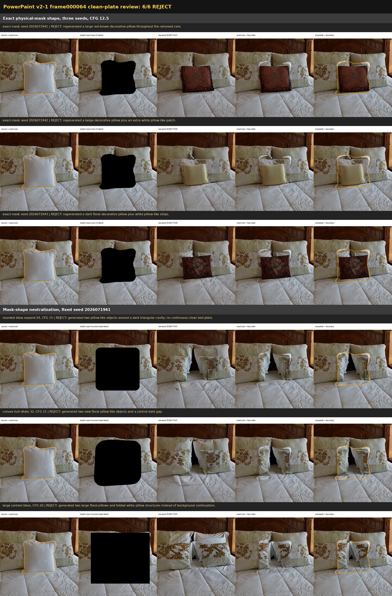

PowerPaint 实验固定官方代码 commit `5b4c3d52291709fcec2a1870d987da693fd3549c` 与模型 snapshot `5ae2be3ac38b162df209b7ad5de036d339081e33`；五个推理必需权重逐文件 size/SHA-256 通过。最终 visual-review receipt SHA-256 为 `ca386fe3852a364d014c3c4dcf59ba62665b822a3b42230f61b538592d03f37a`，总览图 SHA-256 为 `b318268e8eae71bde4d09bef72ccc45696162b7d426dbe1cdb2a32e49d4f4cac`。这说明失败来自当前 R1 条件下的生成语义，不是模型未加载、输入未清空或合成越界。

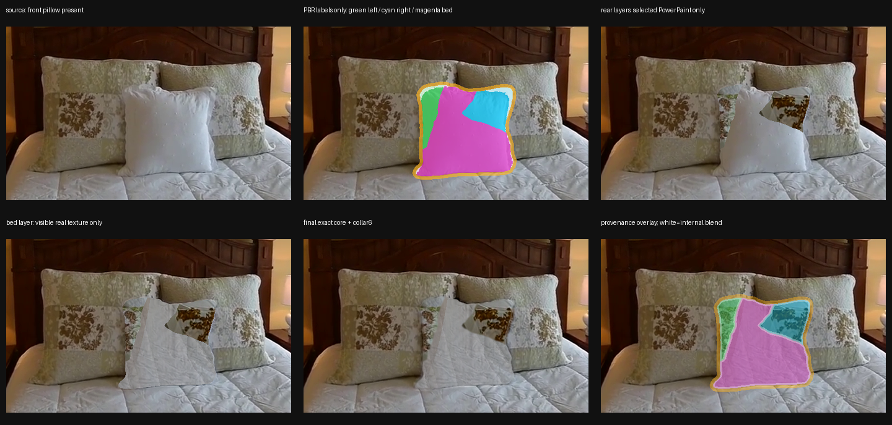

hybrid 保持 exact core+6px collar 外 `0` 像素变化，outer seam color/gradient p95 为 `14.88 / 15.33`，但 internal cross-ownership seam p95 为 `25.77`，core 黑像素 `0.6157%` 超过 `0.2%` 门槛，原 front silhouette edge recurrence 为 `59.22%`，超过 `35%` 门槛。人工审查确认中央床面仍是原枕头形硬楔片，左右后枕被离散 ownership 切成碎片；因此 R1、full25 和 promotion 全部为 `false`。rejection receipt SHA-256 为 `6f7c9eec39b6fd73a7d113c7cadbf45a2f6b45f9b33a87fda6088831abcf9af2`，report SHA-256 为 `ac7600acf7320853956bc59a6091d92a638f11d5c96bb6fc4c3506f1860b75c8`。该结果排除的是离散硬分区实现，不是连续几何传输或联合层优化。

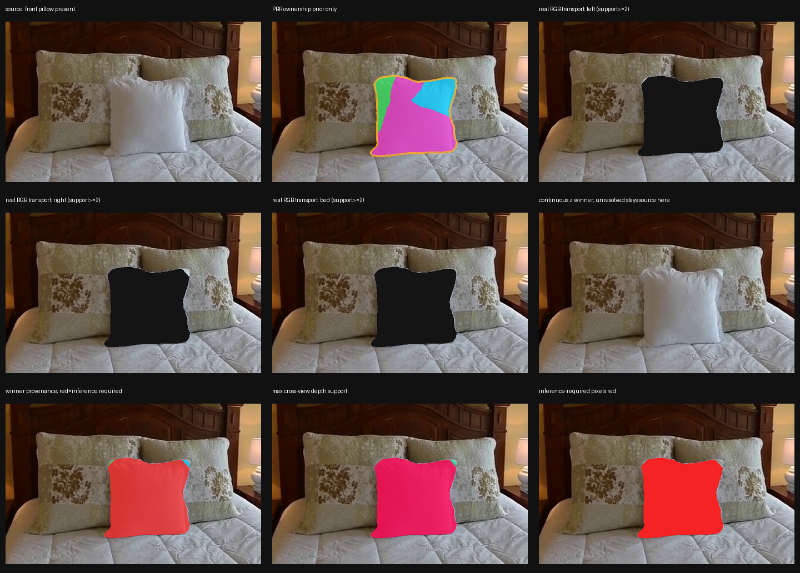

continuous transport 审计使用 stride 1、splat radius 1、per-donor target z-buffer、至少 2 视角支持，以及 `max(0.08 scene-unit, 1%)` 的 depth cluster。frame `000064` core 共 23,065 pixels：left 为 33/2,479、right 为 102/4,426、bed 为 0/16,160；三层 deep-8 都是 0。135 个支持像素全部位于 core 边界 0-8px，inference-required 为 22,930/23,065（`99.4147%`）。因此 pure observed transport 明确 no-go，不是 splat radius 太小导致的假阴性。audit report SHA-256 为 `a062a24702060723a75d2cee0badfe6af0440445e7a85eada59832b677074f0c`，receipt SHA-256 为 `ec97c1a5536c631fb2c1fa6e6a5bb06071d033e9b73014be159ff95bdca3093f`。

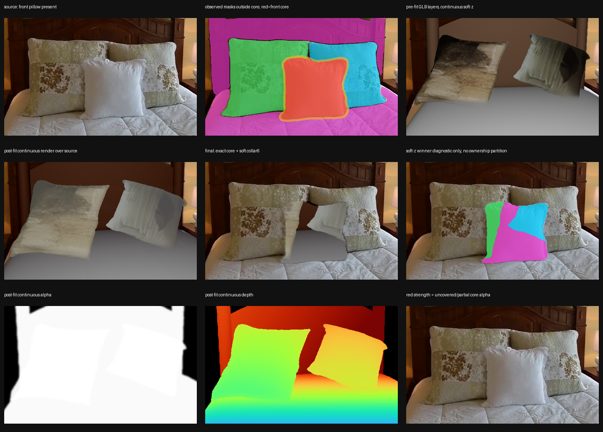

continuous PBR PoC 只使用现有 left/right pillow 与 support-adjusted bed GLB 的真实 RGB/depth/alpha render，不调用生成或 inpainting。core 外 visible IoU 对 left/right/bed 为 `0.8233 / 0.7177 / 0.8878`，但 color-fit RGB MAE 为 `32.10 / 41.85 / 23.51`，高频 NCC 只有 `0.0217 / 0.0071 / 0.0076`。虽然 core uncovered 为 0、编辑区外变化为 0，front silhouette recurrence 仍有 `53.27%`，最终是无纹理灰色 bed slab 与错误 pillow 材质。该实现因此只证明 continuous depth/alpha 可以消除空洞，不能证明当前 PBR 资产能恢复背景；report SHA-256 为 `185b46165431001a87c2c55fb790d438adec2f392257588c81ea75b125c6622b`，rejection receipt SHA-256 为 `aeb10de82d6bd7171dcb4edbab4f0594af1fe0a0a684c4546005a52e1c13cda2`。

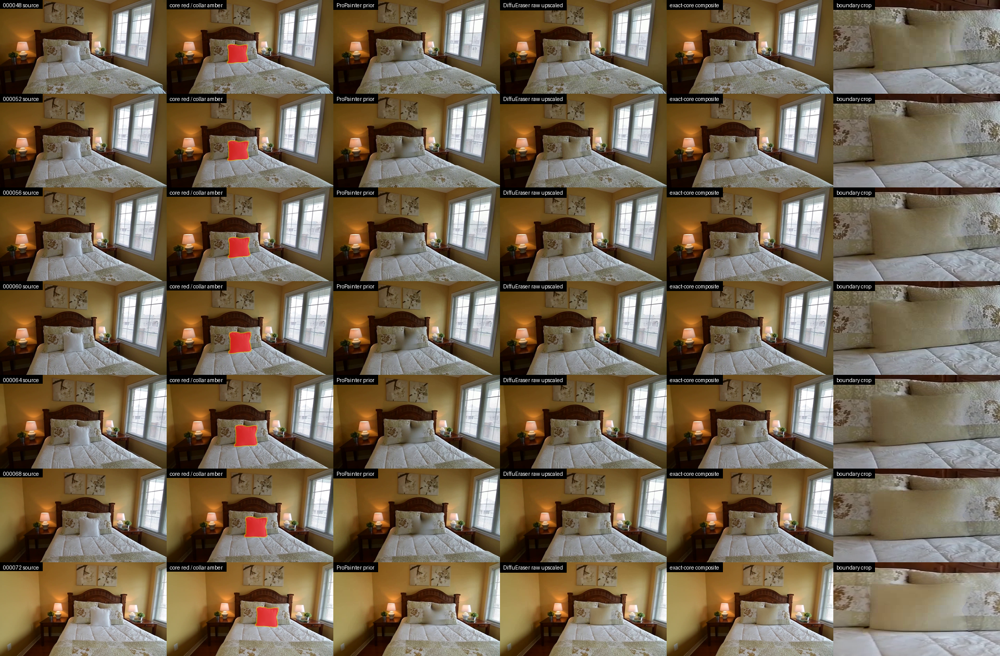

DiffuEraser v1 固定官方代码 commit `8e6f279ac7531e27ad1849c6f8dab5372a8597e7` 与模型 snapshot `ad510dca07fa8e155d4bd8d002085bb8ec8f60e5`；BrushNet/UNet、SD1.5 text encoder、VAE、PCM 与 ProPainter/RAFT 权重均按实际 bytes 和 SHA-256 验签。25 帧保持 exact physical core+6px collar 外 `0` channel mismatch，outer seam mean 为 `3.948`；但真实 SAM3 在 `25/25` 帧检测到 substantial pillow residual。frame `000064` 最佳 pillow mask 与 removed core 的 IoU 为 `0.797`，core coverage `0.895`，detection coverage `0.880`。audited RAFT 生成 48 个 pair 与 23 个 triplet artifacts，但 34 pair failed、14 pair not-evaluable、14 triplet failed、9 triplet not-evaluable，status 为 `not_evaluable`。immutable rejection receipt SHA-256 为 `deb266105876f6385dc9553ed0e7c4938574f8ed7dd794f1accc5d3d47cebd14`。

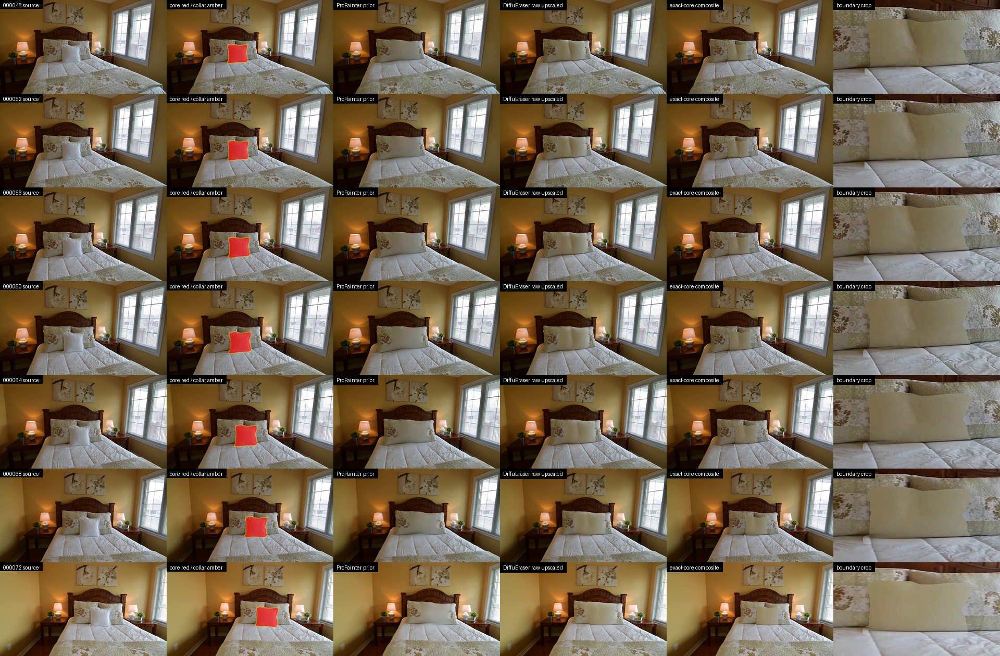

v2 只改变 mask strategy，不扫 seed 或 CFG；lossless input gate 通过，最终仍只写 exact physical core+6px collar。它继续在 `25/25` 帧触发 SAM3 pillow residual；frame `000064` IoU/core coverage/detection coverage 为 `0.790 / 0.886 / 0.880`。outer seam mean 从 v1 的 `3.948` 恶化到 `10.772`，人工审查可见硬边平板、左右截断和底部阴影。因此 v2 未再浪费算力跑 audited RAFT，receipt 明确记录该项为 `null`，immutable rejection receipt SHA-256 为 `743912ee04a2816bb2d888abbfbfc08a73819b1be86147909a34460616c2c70e`。DiffuEraser 族到此停止；其中 ProPainter 先验受 S-Lab License 1.0 限制，只允许非商业研究用途，商业使用还需要另行许可。

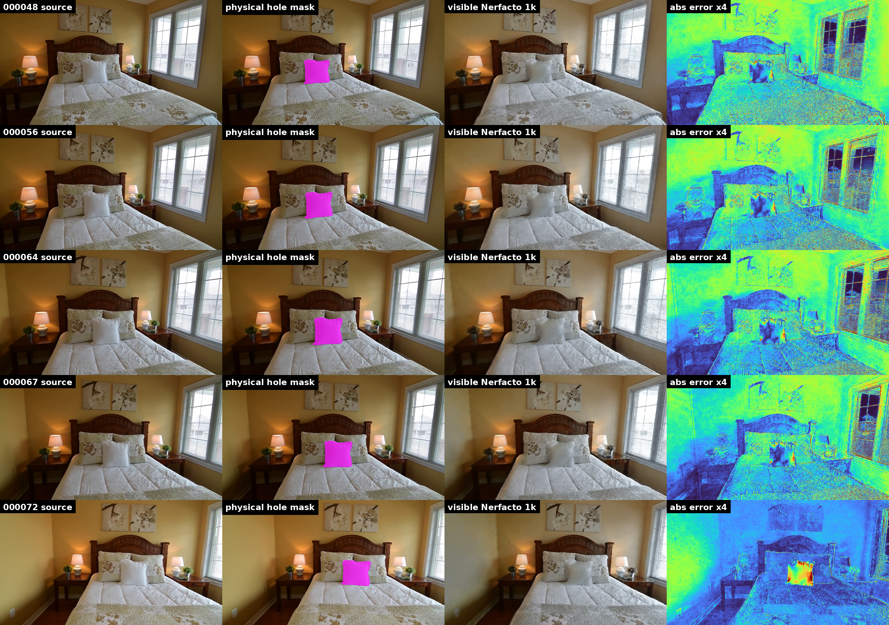

NeRFiller 的 79 视角 dataset contract、camera conversion 与 parser/data-loader 均通过，普通 `nerfacto-nerfiller` 训练 1,000 step 用时 133.44 秒并生成 242,883,154-byte checkpoint；固定 25 帧 `1280x720` source-camera render 用时 221.93 秒，峰值 CUDA allocated 为 11,250,060,288 bytes。visible-region mean PSNR/SSIM 为 `20.66 dB / 0.786`；frame `000064` visible 与 8px collar 分别为 `20.25 dB / 0.774`、`20.78 dB / 0.733`。这些指标只验证已观测区域，hole 内没有 clean-plate 真值；人工复核的 `5/5` 代表帧仍出现完整白色中央枕头，所以 acceptance status 是 `baseline_only_not_a_clean_plate`。immutable baseline receipt SHA-256 为 `517805078da99e4f6841428d6dc62f0b88f2e0d07222f1476ef6ee6edd3dc376`。

官方 NeRFiller 固定 commit `fad4ac133144716cad89103c8160310e3874981e`，其 `grid-prior-du-no-depth` offline probe 已真实经过 dataset cache 和 NeRF construction，并在 15.47 秒后准确失败于 `RGBInpainter.from_pretrained("stabilityai/stable-diffusion-2-inpainting")`。本地官方 snapshot 数量为 0；官方 endpoint 在 20-30 秒内超时，镜像带现有 token 仍不能解析该模型。是否 gated 因官方 API 同样不可达而保持 `unresolved`，不能写成已确认 gated。ZoeDepth 尚未执行，也没有换用替代权重。immutable blocked receipt SHA-256 为 `e15ad90ed18da28a247075dfe759fc70d82482ceeb65f59b24052672e4ce65e5`；因此这是外部权重阻塞，不是 NeRFiller 补全质量已被拒绝。

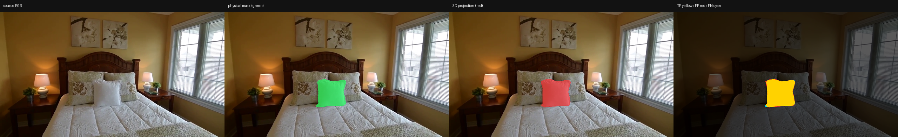

GaussianEditor 备用链固定官方 commit `9249f847c57036266a0bfb3a210681f94264ede9`，严格使用 `000001..000079` 的 79 个 physical front masks，frame `000000` 因没有可靠 front identity 被排除。它复用官方 CUDA `apply_weights` 与 `weights / (counts + 1e-7) > 0.5` 规则，从 871,317 个 PGSR Gaussian 中选出 5,668 个（`0.65051%`）。79 帧同源回投的 micro IoU/precision/recall 为 `0.95696 / 0.97062 / 0.98551`；frame `000064` 为 `0.95996 / 0.96391 / 0.99575`，其中 FP/FN 为 `860 / 98`。这说明 2D-to-3D delete mask 准备可靠，但 QA 与投票使用同一组 79 视角，不是 held-out test；边界 Gaussian 也可能同时承载少量前景和背景。final receipt SHA-256 为 `93d088617c0d28206e780cc0d695f69b0906b1ef10f3c835fff27a483d29412a`。本轮没有下载或运行 SD1.5/ControlNet，也没有得到填充后的统一 3DGS；GaussianEditor 与 vendored Gaussian Splatting 的非商业/研究用途许可证同样禁止把这次技术准备直接当作可商用交付。

## 历史 fresh reconstruction 与 Web 记录

旧四轮之后确实生成过一套 scope-limited 下游资产，这些文件和指标是真实历史记录，不因当前拒绝而删除；但由于 corrected R1 尚未 accepted，它们不属于当前高质量 clean-plate lineage。corrected R2-R4、fresh DA3/PGSR/TSDF、alignment 和 live promotion 均未运行。

更早的 `clean-scene-reconstruction-input-v23` 只绑定单独的 R4 背景候选，PGSR 在 4,210/30,000 主动停止，TSDF 未运行；作废 receipt SHA-256 为 `aaf5837dc931b7d34f0097366297537358821d28a6a274fe8eb5789d4f42ce6d`。随后历史 current-demo-only package 的 manifest SHA-256 为 `3645fc895d202d537a9104d91a21c4ff86e87352c60e3c0f118bdea06adc0299`，receipt SHA-256 为 `33532775d7fe8c3f76724c73b13b68ab01f489d62b5742823a185d52400a468d`。

该历史 run 的 DA3 有 25 张 `720x1280 float32` depth，23,040,000 个值全部 finite/positive，范围 7.7331486-22.4680824；`pointcloud_da3.ply` 有 4,000,000 个 finite/nonzero XYZ，SHA-256 为 `196d170d95404976b0a56ba41654cc23c71cc248955f8fc109a14f10b8ac58d3`。PGSR 在 iteration 30,000 得到 L1 `0.0091873651`、PSNR `33.2610672 dB`、454,617 Gaussians，PLY SHA-256 为 `4eeb1403194e0248f0ab4cbf206572af5bb1ece635a03775cda6e0358133c9bf`。TSDF post mesh 有 1,805,667 vertices / 3,556,615 faces，SHA-256 为 `ccd48c2376d2cc8d81b979813a09c58feb158b66a441d66512466125b0c8f344`。这些是旧输入上的技术产出，不证明背景语义正确，也不能作为 corrected pipeline 当前结果。

历史 clean scene 与四个 unified PBR objects 曾写入 canonical `web/public/worlds/bedroom4/manifest.json`，manifest SHA-256 为 `58cc2b06ec1a7feb70fc0e0060078e0e0e1db409f3e96843c53948c74d3ab7cb`。final browser QA SHA-256 为 `0dc5f2b312e6bef0e272920169993d2485c9e967dec596db047bedd95aa7b961`，当时状态为 `passed_current_demo_only`、`failures=[]`。

旧 QA report 保持 `publishingPerformed=false`；随后 finalization receipt 曾以 exact QA bytes 做 `promoted_current_demo_only`，SHA-256 为 `a7a0691a0effd8898ee2e1a89b3c2a103b966b13005eed51cb52acdb8260c041`。稳定基线别名 `manifest.web-demo-baseline-stable.json` 始终原样保留，SHA-256 为 `3805f0e5bab09add424b3b78f9349cd2eca6d1262777ef683e13cda07695e82b`。本轮没有覆盖 canonical manifest，也没有修改稳定基线。

桌面 `1440x900` fresh load 的 FPS samples 为 `60/58/51/49/56`，平均 `54.8`、最低 `49`；initial runtime FPS 为 `57`。以 bed 为 overview focus 时，投影 coverage 为 width `0.3338`、height `0.4027`，camera-inside object 列表为空。8/8 visual objects 与 8/8 object colliders ready，degraded collider 为 0；console、page error、request failure 与 HTTP error 都为空。


移动端 `390x844` fresh load 的五个 FPS samples 均为 `60`，平均/最低均为 `60`；overview coverage 为 width `0.6840`、height `0.2099`，camera-inside object 列表同样为空。画布与 viewport 都是 `390x844`，8/8 visual objects、8/8 colliders、零 degraded，diagnostics 也没有 console/page/request/HTTP 错误。


这里的历史“promoted”只表示当时 exact manifest、资产加载、交互/碰撞、相机 framing、问答与桌面/移动运行门禁在 Bedroom4 demo 范围内通过。它不表示 corrected pipeline 当前 promoted；旧 R4 的墙面/地面仍有低频拉伸、床形色块与简化平面，截图也没有证明这些区域被真实观测恢复。

## 当前 bedroom_4 状态

下表把 object-local 资产、corrected clean plate 和 archived demo 分开，避免一个子系统通过后替另一个子系统背书。

| 子问题 | 当前证据 | 状态 |
|---|---|---|
| 三个相触前景的实例拆分 | full80 显式 3D-anchor association；front/left/right assignments 为 79/73/80 | physical-instance association 技术通过；不等于 clean plate 通过 |
| 初始 image-to-3D 候选 | front color 不匹配，VLM 指出 missing back | `retry`，未发布 |
| 旧 parametric 浅色候选 | watertight mesh、80k Gaussian、mesh/Gaussian 六视图、浅色 direct-color | 历史 object-only passed；非新默认格式 |
| TRELLIS2 PBR GLB | 60,237 vertices / 97,082 faces；完整厚度；PBR；winding consistent；non-watertight | object-local `surface_bvh` passed with recorded backside-texture limitation |
| scene-space fit + 原相机回投 | front object placement 的 mask IoU 0.709810、bbox IoU 0.924577、中心误差 4.402 px | object placement passed；frame 000067 clean-plate PBR layer QA 仍 rejected |
| 支撑与穿模 | support-adjusted bed receipt 的 9 项 gate 全通过；三个枕头预测 penetration/gap 在 0.2 scene-unit policy 内 | object/placement 技术通过；Web 数字只属于历史 demo |
| ProPainter full-mask clean plate | 技术执行成功，但产生灰白模糊光斑 | 历史 rejected |
| corrected physical donor diagnostic | front-only 21,717/532,888，但 96.14% 在边界 8px 内；深内部 0.2005% | boundary constraint only；`promotion_approved=false` |
| corrected strict R1 | exact source binding、physical exclusion 和 cumulative contract 通过；frame 000064 support 256 -> guard-stable 0 | `technical_failed`；尚无 accepted R1 |
| full80 continuous transport | 78 donors + depth/2-view consistency 后 core 0.5853%，deep-8 0%；bed support 0 | `pure_transport_no_go` |
| PowerPaint/PBR layer hybrid | 外圈 exactness 与 seam 通过；内部 silhouette recurrence 59.22%，hard ownership 仍留下枕头形楔片 | `rejected`；未扩到 full25 |
| continuous PBR scene fit | alpha 全覆盖、outside exact；高频 NCC 近 0，front silhouette recurrence 53.27% | `rejected`；当前 scene-fit GLB 不可作隐藏背景 |
| DiffuEraser v1/v2 | 两轮均 outside collar 0 mismatch；v1 SAM3 `25/25` residual 且 RAFT 不通过，v2 形成硬边平板且 SAM3 仍 `25/25` | `rejected`；模型族已停止 |
| Nerfacto visible baseline | 79-view parser/train 通过；fixed25 mean visible PSNR 20.66 dB，但 5/5 代表帧 hole 内仍是白色中央枕头 | `baseline_only_not_a_clean_plate` |
| NeRFiller grid-prior | offline probe 到达官方 SD2 加载；本地无 snapshot、官方 endpoint 超时、镜像不可解析 | external weight blocked；生成补全未运行 |
| GaussianEditor 3D delete mask | 5,668/871,317 Gaussians；79-view micro IoU 0.95696，frame 000064 IoU 0.95996 | delete-mask prep 技术通过；背景 completion 未运行 |
| SDXL seed 2026071701 | mask 外逐像素不变；移除区仍有枕头状生成 | archived `accepted_for_current_demo` exception；不属于 corrected R1 |
| 旧 R1-R4 sequence | predecessor hash 曾闭合；但 R2/R3 source 25/25 mismatch，PBR observed boundary QA rejected | archived/rejected；不得作为当前 clean plate |
| corrected R2-R4 | R1 尚未 accepted | blocked，未运行 |
| 旧 DA3 / PGSR / TSDF | 25 depth、4M DA3 points、454,617 Gaussians、TSDF 1,805,667 vertices | 真实 historical current-demo-only artifacts；输入链已被当前审计拒绝 |
| corrected fresh reconstruction | 需要 accepted R4 | DA3/PGSR/TSDF/alignment 均未运行 |
| canonical Web | 旧 manifest/QA/finalization receipt 仍作历史记录；stable alias `3805f0e5...5e82b` 未变 | 本轮未 promotion、未更新 live |

因此当前结论必须写成：**独立 TRELLIS2 PBR 枕头在整体形状、完整厚度、浅色主色和 object placement 上可以按 minor-limitation 口径放行；clean plate 是另一条尚未通过的链。corrected full80 physical association 已通过，但 measured donor 只足以约束边界，strict frame 000064 在 boundary guard 后 coverage 为 0，R1 尚未 accepted。按照前一轮未通过则后续不得启动的合同，corrected R2-R4、fresh DA3/PGSR/TSDF、alignment 和 live promotion 均未运行。旧 R1-R4、旧 reconstruction 和旧 Web promotion 仅作为 archived current-demo-only 历史证据保留，不能称为当前高质量背景补全。**

## Scene commands 如何触发补全

自然语言查询只读取 scene graph；add/delete/update/split/merge/reparent 则先生成 typed preview，不直接改 manifest。服务端重新加载固定 WorldManifest、重建 Pydantic plan，并把确认短语绑定到 request、intent 和 manifest hash。确认后返回 `queued` 只表示写入 immutable async job，不表示 pipeline 已完成。

命令与补全的关系如下：

| 命令 | 触发的补全行为 |
|---|---|
| add | segmentation -> lift -> routing -> object completion -> placement -> clean plate/reinspect |
| delete | tombstone 对象，但必须修复暴露背景并重建相关 scene layers |
| split | 为每个稳定实例建立独立 evidence、completion history 与父子关系 |
| merge | 合并语义单元并重新验证 child、placement、bundle 和 Web |
| update appearance/interaction | 外观证据变化时重跑 completion；启用 collision 时必须验证同一 PBR GLB 的 collider role/topology（旧模式才生成独立 collider） |
| reparent | 保持 world transform，重跑 cognition/placement/bundle/Web 层级 QA |

客户端 preview、`clientPreview.targetIds` 和阶段列表都不是执行真值。歧义目标、过期 manifest、错误确认短语或 invariant 失败均返回 blocked，且不会创建 job。

## 证据与文档图来源

文档图是现有 evidence 的逐字节副本，没有重新渲染或美化：

| 文档资产 | 原始 evidence | SHA-256 |
|---|---|---|
| `assets/completion/object-mesh-six-view.png` | `examples/bedroom4/completion/parametric_pillow_front_attempt1/browser_six_view_contact_sheet.png` | `3d94fa48f8bcc899e6e804a0b6f9df1bd18cb6effea70bb530e4809a058f3ed9` |
| `assets/completion/object-gaussian-six-view.png` | `examples/bedroom4/completion/parametric_pillow_front_attempt1/gaussian_six_view_contact_sheet.png` | `8437bbf5daec603362c78cb6db7407632d23eee38c5ad35c5b45bd4b7a44f2e8` |
| `assets/completion/object-pbr-six-view.png` | `examples/bedroom4/completion/trellis2_pillow_front_seed42/scene_fit_silhouette_refined/canonical_six_view_review/object_six_view_contact_sheet.png` | `5b11f4069bcf66bbe09638fef849c24afc43d14d147648e7e44acd6e0f7a9f5a` |
| `assets/completion/clean-plate-donor-prefill.png` | `examples/bedroom4/completion/clean_plate_round2_multiview/multiview_prefill_contact_sheet.png` | `e0691b29a0df1d21c7fecf1cb62892e64bb1e03b5b2bba7bbd1cbe165787ccf1` |
| `assets/completion/clean-plate-edge-leakage.png` | `examples/bedroom4/completion/clean_plate_round2_multiview/frame64_zero_margin_support.png` | `b8fa37496391f42d6823fc9b7421a7fc75926d504b1fc1fa7bb763a3ed4689b4` |
| `assets/completion/clean-plate-physical-donor-audit.png` | `/data/design/zyx/workspace/video2world_runs/bedroom4_clean_plate_boundary_fix_20260718/r1_front_only_multiview_prefill_20260719_v1/audit_full25_repv2params/front_only_vs_all_pillow_contact_sheet.png` | `4a5bc7a71907e20cdafd736a9831984f34caf3c3d00a978b722ca6627fb9ec18` |
| `assets/completion/clean-plate-boundary-guard-rejection.png` | `/data/design/zyx/workspace/video2world_runs/bedroom4_clean_plate_boundary_fix_20260718/r1_strict_physical_pipeline_smoke_20260719_v2/prefill_frame64_default_guard/multiview_prefill_contact_sheet.png` | `35238cd70530792c7f49687126c5a10d3059502531b5c3cde4c75c16219a4590` |
| `assets/completion/clean-plate-powerpaint-v2-1-rejected.png` | `/data/design/zyx/workspace/video2world_runs/bedroom4_clean_plate_boundary_fix_20260718/powerpaint_v2_1_frame000064_smoke_20260719_v1/contact_sheet_final_all_six_rejected.png` | `b318268e8eae71bde4d09bef72ccc45696162b7d426dbe1cdb2a32e49d4f4cac` |
| `assets/completion/clean-plate-powerpaint-layer-hybrid-rejected.png` | `/data/design/zyx/workspace/video2world_runs/bedroom4_clean_plate_boundary_fix_20260718/video2world-powerpaint-layer-hybrid-frame000064-v1/output/contact_crop.png` | `0f65e5fe9fa057edfca5564f91502a44e3e17daa2900b2a00563a34a96d45b34` |
| `assets/completion/clean-plate-continuous-transport-audit.png` | `/data/design/zyx/workspace/video2world_runs/bedroom4_clean_plate_boundary_fix_20260718/continuous_depth_alpha_transport_audit_frame000064_v1/output/contact_crop.png` | `7639bdcd223007145429cb87764822f4c2343bdd2b433232479ebb22cd37b931` |
| `assets/completion/clean-plate-continuous-pbr-rejected.png` | `/data/design/zyx/workspace/video2world_runs/bedroom4_clean_plate_boundary_fix_20260718/continuous_pbr_remaining_scene_frame000064_v1/output/contact_crop.png` | `2e43292ae8a40a02152514365377265a27c26428454c16838dd20991ab2aa8ca` |
| `assets/completion/clean-plate-diffueraser-v1-rejected.png` | `/data/design/zyx/workspace/video2world_runs/bedroom4_clean_plate_boundary_fix_20260718/diffueraser_full25_r1_20260719_v1/qa/contact_sheet_keyframes.png` | `753a0799c7721aeeb178f20fc32090f48b7bd110bfc11d5129b14ff346b43e49` |
| `assets/completion/clean-plate-diffueraser-v2-rejected.png` | `/data/design/zyx/workspace/video2world_runs/bedroom4_clean_plate_boundary_fix_20260718/diffueraser_full25_r1_shape_neutral_v2_20260719_v1/qa/contact_sheet_keyframes.png` | `07704e78151a06dc9905dd963bcd799504fe6810a73e6fff31da39278b2e82d4` |
| `assets/completion/clean-plate-nerfiller-visible-baseline-rejected.png` | `/data/design/zyx/workspace/video2world_runs/bedroom4_clean_plate_boundary_fix_20260718/nerfiller_front_pillow_physical79_20260719_v1/visible_baseline_nerfacto/qa_fixed25/visible_baseline_fixed25_contact_sheet.png` | `9e9f63c9a6fb4365dc37fbe31d29193889b412ff8a97c0551a7e31e561f354cb` |
| `assets/completion/clean-plate-gaussianeditor-delete-mask-prep.png` | `/data/design/zyx/workspace/video2world_runs/bedroom4_clean_plate_boundary_fix_20260718/gaussianeditor_external_mask_prep_20260719_v1/output/qa/frame000064_projection_contact.png` | `a16f7616882fcebdfb4b6ee81cda29c328bf3a2040c4b6d42bc677ec9cfaae1a` |
| `assets/completion/source-camera-silhouette.png` | `examples/bedroom4/completion/parametric_pillow_front_attempt1/scene_fit_silhouette_refined_attempt3/source_camera_review/source_camera_silhouette_overlay.png` | `e8c7648f6b18bcebb217031f34b366e813da25dfcbff928093fc808a6a8263d3` |
| `assets/completion/source-camera-pbr-silhouette.png` | `examples/bedroom4/completion/trellis2_pillow_front_seed42/scene_fit_silhouette_refined/source_camera_review/source_camera_silhouette_overlay.png` | `ade9e0c9632da1ac9f01300d0ca8805754ff82b7188614704913b2ac0d3f6aa0` |
| `assets/completion/clean-plate-sdxl-seed-2026071701.png` | `examples/bedroom4/completion/clean_plate_round3_sdxl_anchor/candidate_seed_2026071701.png` | `26a734c0296d98790ed4daaf5a5a7b45c64f25430ab95e6115e9a26eff41d7b0` |
| `assets/completion/layered-source-25view.png` | `examples/bedroom4/completion/layered-peel/layered-clean-plate-sequence-v1/qa/source_contact_sheet.png` | `c18e229a9b1c9b04bcb044039d9dcdb67d78c9631ce965131b47df67e4869b71` |
| `assets/completion/layered-round01-front-pillow.png` | `examples/bedroom4/completion/layered-peel/layered-clean-plate-sequence-v1/qa/round01_contact_sheet.png` | `fdbdc172137391bf46890ceeed026f3b9a678e7271353db5e44b9133a8749066` |
| `assets/completion/layered-round02-left-pillow.png` | `examples/bedroom4/completion/layered-peel/layered-clean-plate-sequence-v1/qa/round02_contact_sheet.png` | `07403a3fac576710b9fdaec3956091e623051fdb6080ac1115daf01ded4b8aa3` |
| `assets/completion/layered-round03-right-pillow.png` | `examples/bedroom4/completion/layered-peel/layered-clean-plate-sequence-v1/qa/round03_contact_sheet.png` | `f30829672c48ca826c2fce37a6f4f9c01d7504e9f8393567a261cea01e7477a6` |
| `assets/completion/layered-round04-final-background.png` | `examples/bedroom4/completion/layered-peel/layered-clean-plate-sequence-v1/qa/round04_contact_sheet.png` | `4118d32e18c7151dc2013036c07a7dc2229e039730c01098c5e04684767fa7a0` |
| `assets/completion/strict-clean-scene-web-desktop.png` | `web/public/worlds/bedroom4/qa/clean-unified-scene-browser-final-promoted/desktop-1440x900.png` | `c7b6bbbec80aad6fad79db7a71db0413c8af65d2e64e6f95eb760ed12566cc3d` |
| `assets/completion/strict-clean-scene-web-mobile.png` | `web/public/worlds/bedroom4/qa/clean-unified-scene-browser-final-promoted/mobile-390x844.png` | `3ed94cb223727c8397bda9166f40eaab73fefdc2e5f667c8258e06c8d884a692` |

corrected 当前证据位于 mil8 的 `/data/design/zyx/workspace/video2world_runs/bedroom4_clean_plate_boundary_fix_20260718/`：full80 association、physical front-only audit 与 `r1_strict_physical_pipeline_smoke_20260719_v2/` 分别绑定 identity、diagnostic boundary coverage 和 strict R1 rejection；`nerfiller_front_pillow_physical79_20260719_v1/` 绑定 79-view NeRF baseline 与官方 SD2 access blocker；`gaussianeditor_external_mask_prep_20260719_v1/` 绑定 2D-to-3D delete-mask preparation。旧 `layered-clean-plate-sequence-v1/execution_receipt.json`、sequence report、四轮 composite receipts、portable R4 mask index、旧 fresh geometry receipts 与 canonical Web finalization receipt 继续保留为 archived current-demo-only 证据。文档只解释 receipt，不覆盖 receipt；旧 receipt 的存在也不会覆盖 corrected gate 的拒绝结论。

## 最低发布条件

一个对象层只有同时满足以下条件才算 passed：

1. stable instance、source frames、masks、camera/depth 和 appearance contract 可追溯；
2. front 保留 observed 的整体形状、主色类别和关键部件，六视图有真实厚度且不存在缺面/片状；轻微不可见面纹理或材质幻觉可以 `status=passed`，但必须记录 limitation；
3. VLM/技术 review 按 severity 在最多三次内 accept；只有明显形变、主色错误、缺面/片状或部件断裂触发 retry/reject；
4. scene fit、支撑、对象间和对象/背景穿模通过；
5. clean plate 的 mask 外不变、跨视图、背景语义和新 depth/normal 通过；
6. clean scene Gaussian/mesh 与 unified object GLB 共坐标；旧多表示模式中的 object visual/collider 也必须共坐标；
7. Web overlay、旋转、碰撞、focus 与 scene QA 通过；
8. 所有输出有 hash、provider、seed/prompt、状态和 limitation。

任一 blocking 项失败，当前层和更深遮挡层保持 blocked。用户可以对指定 demo 做 scope-limited 人工放行，但 receipt 必须同时列出 allowed scope 和 not-proven claims；这种放行不会把单帧生成升级为 object-free/multiview 几何证据。保留失败 evidence 和 minor limitation 是系统能力的一部分，因为它既阻止“片状对象已经补全”这样的明显错误，也避免因轻微不可见面纹理偏差无限重跑。
