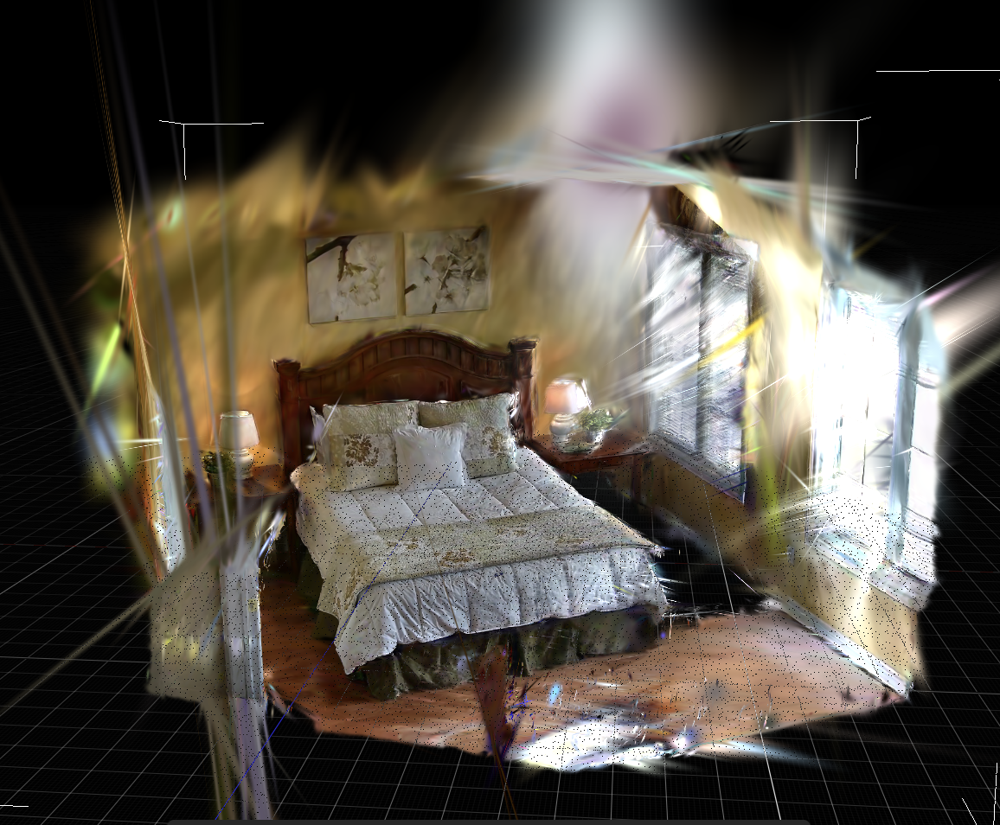

# 安装、配置与恢复执行

Video2World 本体是轻量 orchestration/runtime 项目，不把 PGSR、SAM3、DA3 和 TRELLIS 强行塞进同一个 Python/CUDA 环境。各模型保留独立环境，pipeline 通过 argv adapter 和强类型产物合同连接。



## 安装

```bash
git clone https://github.com/Interstellar6/video2world.git
cd video2world
uv sync --all-groups
npm install

uv run video2world --help
npm test
npm run build
```

Python 要求 3.11+；Web 要求当前 Node LTS 或更新版本。SAM3/PGSR/TRELLIS 的 CUDA 与权重由各自上游环境管理。

## 初始化一个 run

```bash
uv run video2world init runs/my-room \
  --video /absolute/path/to/scan.mp4 \
  --scene-id my_room

uv run video2world plan runs/my-room
uv run video2world run runs/my-room --dry-run
```

默认 adoption 模板的十二个 stage 都是 `command: null`：`ingest -> inventory -> da3/pgsr -> sam3 -> fusion -> cognition -> completion_plan -> layered_completion -> placement -> bundle -> web`。这是有意的安全边界：项目不会猜远端 Conda、checkpoint 或上游仓库路径。`plan` 会把阶段标为 `adopt_or_configure`，直到用户配置 argv 或明确登记已有产物。

## 使用完整十二阶段 site profile

`site_profile.example.yaml` 把每个 canonical stage 明确指定为 `execute` 或 `adopt`；`site_provider.example.yaml` 定义真实 argv、角色、解释器、checkout、checkpoint 与 timeout。初始化时所有根目录都以 `name=/absolute/path` 传入，仓库不会从本机历史路径猜测。

```bash
cp video2world/configs/site_profile.example.yaml /secure/site/video2world-site.yaml
cp video2world/configs/site_provider.example.yaml /secure/site/video2world-provider.yaml
# 编辑两份副本，绑定现场 driver 与精确 source revision。

uv run video2world site-init runs/my-room \
  --video /absolute/path/to/scan.mp4 \
  --scene-id my_room \
  --profile /secure/site/video2world-site.yaml \
  --provider-contract /secure/site/video2world-provider.yaml \
  --checkout video2world=/srv/video2world \
  --checkout site_drivers=/srv/video2world-site-drivers \
  --checkout holi=/srv/Holi-Spatial \
  --checkout da3=/srv/Depth-Anything-3 \
  --checkout pgsr=/srv/PGSR \
  --checkout sam3=/srv/SAM3 \
  --checkout video2mesh=/srv/Video2Mesh \
  --checkout trellis2=/srv/TRELLIS.2 \
  --artifact-root envs=/srv/envs \
  --artifact-root models=/srv/models
uv run video2world site-preflight runs/my-room
uv run video2world site-run runs/my-room
```

`site-init` 生成的 12 个 stage 都有非空 argv。`site-preflight` 只检查 binding、Git commit、解释器、driver、仓库和 checkpoint，不启动模型；`site-run` 对 execute stage 复用无 shell provider contract，对 adopt stage 写内容寻址 adoption state。每步都有 stage state，整次调用另写 site preflight/run receipt。profile、provider contract 或源文件变化后缓存失效；任一 provider/artifact 缺失时 fail closed，不生成 synthetic placeholder。

`layered_completion` 的 terminal report 只有在全部 front-to-back rounds 完成时才通过：report 必须显式声明 `lineage_scope="corrected_full_pipeline"`，并且必须和同批 `provider_receipt` 一起提交，以绑定真实执行过的 completion plan SHA-256；provider receipt 本身也会被校验为 `video2world.provider_execution_receipt`，并检查 inputs/outputs snapshot 的 hash、size 和 file_count，还会对 JSON/PLY 角色执行语义校验。round 必须连续消费上一轮 clean plate hash，每轮都绑定新的 scene-audit receipt、SAM3 receipt、quality report 与 output clean plate；这些 execution receipt 的 hash 不能跨角色或跨轮复用，也不能复用 clean plate artifact。object round 还要为每个 `target_id` 绑定一份对象建模 receipt，且中间 clean plate 只能是 `acceptance_scope="corrected_clean_plate_next_round_source_only"` / `lineage_scope="corrected_clean_plate_round_source"`，不得声明 corrected full pipeline、promotion 或 canonical manifest mutation。末轮必须是带真实 background rebuild receipt 的 `final_background`，只有 terminal output 与 `final_clean_plate` 才能声明 corrected full-pipeline promotion。`current_demo_only`、archived Web promotion、旧四轮 sequence、无 provider receipt 的 report、越权 next-round source 或单个 front pillow 候选都不能满足这个合同。

同批 `provider_receipt.inputs` 必须内容寻址绑定完整 layered stage 输入：`frames_manifest`、`cameras`、`layered_completion_plan`、`scene_gaussian`、`scene_mesh`、`masks_manifest`、`captions_manifest`、`object_clouds_manifest`、`semantic_gaussian`、`object_facts`。`provider_receipt.outputs` 也必须绑定完整输出：`completed_object_assets_manifest`、`clean_scene_gaussian`、`clean_scene_mesh`、`clean_plate_manifest`、`layered_completion_report`。adapter 会重新 hash 每个 snapshot path，并读取对应资产验证 JSON 可解析、Gaussian/Mesh PLY 头字段齐全；`semantic_gaussian` 必须同时带 Gaussian 字段、`object_id` 和 `object_probability`，`completed_object_assets_manifest.objects[*].id` 必须与 executed plan/report 的 planned targets 一致。缺任一角色、hash/size/file_count 不一致、语义字段缺失，或 receipt 指向另一份 report/plan/clean scene 资产，都会 fail closed。

`examples/bedroom4/site-profile.partial.yaml` 把当前真实 PGSR、SAM3、fusion 和 cognition 文件映射到对应 adoption role。fusion 的五项输入 hash 已从现有归档完整恢复；但旧归档没有原始视频 hash，PGSR/SAM3/cognition 也缺部分 canonical input receipt，所以这些 stage 故意不填完整 `expected_inputs`，`site-preflight` 会阻断采用。找回并填写输入 hash 后才能登记。inventory/DA3、completion plan、完整 layered completion、placement、bundle 与 Web 仍保持 execute；在真实逐层补全完成前不会产生 `complete_pipeline=true`。

旧 `holi_embodiedgen_upstream.yaml` 与 `holi_embodiedgen.provider.example.yaml` 仍保留为历史十阶段 adapter 示例；它们缺少 canonical `inventory + completion_plan + layered_completion`，不能作为新 pipeline 完成证据。

## 运行官方 TRELLIS.2 mesh-first provider

`video2world.providers.trellis2_asset` 是单对象 provider；站点级 TRELLIS batch driver 应逐个读取已验证的对象 RGBA、调用该模块，再把每个 receipt 聚合成 `object_assets_manifest`。默认输入必须含有效 alpha 前景和透明背景，不会静默运行 RMBG；只有数据合同明确允许模型抠图时才加 `--allow-rmbg`。

```bash
cd /absolute/path/to/video2world

/absolute/path/to/trellis/python -m video2world.providers.trellis2_asset \
  --trellis-source-dir /absolute/path/to/TRELLIS.2 \
  --weights /absolute/path/to/TRELLIS.2-4B \
  --config-file pipeline_512.json \
  --input-rgba /absolute/path/to/object-front.rgba.png \
  --output-dir /absolute/path/to/object-candidate \
  --seed 42 \
  --decimation-target 100000
```

默认目录只增加必需的 `asset_pbr.glb`、模型实际消费的 `processed_input.png` 和 `trellis2_asset_receipt.json`。raw vertex-color mesh、surface point cloud 和 convex hull 只在显式传入 `--debug-raw-mesh`、`--debug-point-cloud` 或 `--debug-convex` 时导出，不属于 production 资产合同。

provider 会先核对 source checkout，再运行官方 `Trellis2ImageTo3DPipeline` 与 `o_voxel.postprocess.to_glb`，最后重新加载 `asset_pbr.glb`，检查 transform/vertex finite、triangle index、退化面、winding、PBR material、正 extents、面数上限和 topology。每个材质还记录 metallic/roughness factor、base-color factor、baseColorTexture 的尺寸/模式/解码像素 hash 与数值范围，以及 alpha mode/cutoff/channel 和 double-sided；数值必须 finite 且位于 `[0,1]`。任何技术项失败都写 `status=failed` receipt 并返回非零；技术通过的状态仍是 `technical_passed_visual_pending`，不能直接发布。

这些字段是可追溯的 PBR 证据，不是物体类别判断。例如 `metallicFactor=1` 在 glTF 范围内，不能被通用 provider 直接判错；它是否符合枕头、金属灯或其他对象，由 scene-fit material profile 与 VLM 结合原视频决定。视觉 hard gates 仍只有明显 shape mismatch、主色类别错误、缺面/片状、断开部件和显著场景穿模；轻微背面纹理或材质 hallucination 只记 warning/limitation，可以按当前验收口径放行。

2026-07-17 在 mil8 上实际复核的 lineage 是：Microsoft TRELLIS.2 source commit `75fbf0183001ed9876c8dbb35de6b68552ee08bd`，`microsoft/TRELLIS.2-4B` revision `af44b45f2e35a493886929c6d786e563ec68364d`，`pipeline_512.json` SHA-256 `308dd782f3eaf1e30e7403ee3837f21beefa664202b0a045ca61308a42c661b3`。每次运行仍记录现场 checkout、model revision、config、seed、输入与最终 GLB 的实际 hash，不能只引用这组历史值。

技术通过后，用 canonical Web object review 生成正交六面证据：

```bash
npm run dev -- --port 4173

ASSET=/absolute/path/to/object-candidate/asset_pbr.glb
node scripts/capture_object_review.mjs \
  --url "http://127.0.0.1:4173/object-review.html?objectId=chair01&asset=/@fs${ASSET}" \
  --output-dir /absolute/path/to/object-candidate/review
```

脚本从 `web/object-review.js` 读取固定的 `front/right/back/left/top/bottom` object-local 视图，输出六张 object-only PNG、3x2 contact sheet 和包含 GLB/图片 hash 的 `video2world.canonical_object_six_view_review` receipt。水平 orbit 即使有六帧也不算六面证据；capture 只完成取证，视觉 gate 仍保持 pending，必须再按形状、主色和场景穿模门禁作出 review 决策。

## 规划通用分层补全

先由严格 scene inventory 与标定几何生成遮挡图，再构建 front-to-back rounds：

```bash
uv run video2world completion-plan \
  --inventory runs/my-room/artifacts/inventory/scene-inventory.json \
  --occlusion-graph runs/my-room/artifacts/inventory/occlusion-graph.json \
  --output runs/my-room/artifacts/completion/plan.json \
  --max-parallel-targets 1

uv run video2world completion-validate \
  runs/my-room/artifacts/completion/plan.json

uv run video2world completion-route \
  runs/my-room/artifacts/completion/objects/chair01/evidence.json \
  --output runs/my-room/artifacts/completion/objects/chair01/backend-route.json
```

`completion-route` 只在 physical instance 与 appearance contract 通过后，才在多视角重建、柔性类别先验、CAD 检索、生成式 image-to-3D 和结构支撑面重建之间选择。证据不足时返回非零并选择 `hold_for_more_evidence`。详细 round 输入输出与门禁见 [通用遮挡、背面与背景分层补全](completion.md)。

## 配置 argv adapter

编辑 `runs/my-room/run.yaml`，为阶段写 argv 数组，不使用 shell 字符串：

```yaml
stages:
  pgsr:
    adapter: holi_pgsr
    needs: [ingest, da3]
    command:
      - /absolute/conda/env/bin/python
      - /absolute/upstream/train.py
      - --source_path
      - "{run_dir}/artifacts/ingest"
      - --model_path
      - "{run_dir}/artifacts/pgsr/model"
    cwd: /absolute/upstream/PGSR
    outputs:
      scene_gaussian: "{run_dir}/artifacts/pgsr/scene_gaussian.ply"
      scene_mesh: "{run_dir}/artifacts/pgsr/tsdf_scene.ply"
```

模板字段只允许预定义 key，命令由 `subprocess` 直接执行；敏感环境值必须写 `${ENV_VAR}` 引用，不能落盘到 config。

## 登记已有真实产物

已在 Holi-Spatial、Video2Mesh 或 EmbodiedGen 跑完的结果不必重算。按 stage 的 required roles 显式 adopt：

```bash
uv run video2world adopt-existing runs/my-room pgsr \
  --output scene_gaussian=/absolute/run/point_cloud.ply \
  --output scene_mesh=/absolute/run/tsdf_fusion_post.ply \
  --source-run-id holi-pgsr-30k-20260716 \
  --source-repository /absolute/Holi-Spatial \
  --source-commit <commit>
```

adopt 不会声称执行了外部命令，也不会把文件存在等同于质量通过。它记录 source run/repo/commit、真实内容 hash 和文件大小；原文件变化后 stage 自动失效。

## 恢复与目标执行

```bash
uv run video2world plan runs/my-room
uv run video2world run runs/my-room --stage bundle
uv run video2world run runs/my-room --stage web
```

恢复判断同时比较 stage config、显式输入、依赖 output hash 与本 stage output hash。目录同名但内容不同不会命中 cache；失败或中断阶段会重新执行，已验证且未变化的依赖保持 cached。

## 验证与查询

```bash
uv run video2world validate runs/my-room/bundle/world.json
uv run video2world query runs/my-room/bundle/world.json "枕头在哪里?"
uv run video2world query runs/my-room/bundle/world.json "第二株植物长什么样?"
```

`validate` 重新计算本地资产 SHA-256；`query` 完全离线，未知对象、多实例歧义或缺少 evidence 时 fail closed。坐标标为 `scene_scale_not_metric` 时，回答不会把数值误写成米。

## Web 开发

```bash
npm run dev -- --port 4173
```

打开 `http://127.0.0.1:4173/` 会加载仓库内的微型浏览器 fixture，保证 fresh clone 不依赖本地大资产也能冒烟验证。生产 bedroom bundle 通过 `?manifest=/worlds/bedroom4/manifest.json` 指定；其数百 MB 分片资产由本地 materializer 或发布构建提供，不进入 Git 和 JavaScript bundle。

## Web 场景命令服务

Web production manifest 与 canonical `WorldManifest` 是不同合同。先生成只用于规划的 canonical sidecar，再生成一份新的、带 canonical hash 与本地 endpoint 的派生 Web manifest；命令拒绝原地覆盖 production 文件：

```bash
uv run video2world web-manifest-adopt \
  web/public/worlds/bedroom4/manifest.json \
  --output examples/bedroom4/manifests/bedroom4.production-planning.canonical.json

uv run video2world web-manifest-bind \
  --web-manifest web/public/worlds/bedroom4/manifest.json \
  --canonical-manifest examples/bedroom4/manifests/bedroom4.production-planning.canonical.json \
  --endpoint http://127.0.0.1:8765/v1/scene-commands/submit \
  --derived-version bedroom4-local-command-qa \
  --output examples/bedroom4/manifests/bedroom4.production-command-local.web.json

uv run video2world scene-command-serve \
  --manifest examples/bedroom4/manifests/bedroom4.production-planning.canonical.json \
  --web-manifest examples/bedroom4/manifests/bedroom4.production-command-local.web.json \
  --queue-dir /private/tmp/video2world-scene-command-queue \
  --host 127.0.0.1 \
  --port 8765 \
  --cors-origin http://127.0.0.1:4173
```

服务端固定加载两份 manifest，并校验 `worldId + runId + canonical hash`；浏览器提交的 preview 不是执行真值。query 可直接返回 description/location；add/delete/update/split/merge/reparent 先由服务端重新规划，绑定本次 plan 的确认短语后才写 immutable `attempt=0` job。`queued` 只表示任务进入队列，后台 worker 仍需按 receipt 逐阶段执行和验收，不能显示成“场景已修改完成”。

adoption sidecar 中的 `web-bundle://` 是 planning-only URI，scene assets 保持 `candidate`；通用资产验证器尚不能解析这个 scheme，所以它不是完整可移植 world bundle，也不能代替原 Web bundle 的 JavaScript schema 与浏览器 QA。
