# Pipeline：从视频到可交互 3D 世界

Video2World 接收一段扫描视频，最终输出的不是一个孤立 PLY，而是一个分层 world bundle：场景整体由 PGSR Gaussian 负责视觉、TSDF mesh 负责静态碰撞；独立对象默认以一个 mesh-first PBR GLB 同时承担可见表面、选择/拖拽/旋转逻辑和 MeshBVH character surface collision。SAM3 与多视角投影负责语义实例，evidence-based completion 为不同对象选择多视角重建、类别先验、CAD 检索或生成候选，scene graph 与描述 sidecar 负责查询。对象 Gaussian/point cloud 是可选资产，不再是交付前提。

```text
video
  -> 01 ingest: frames + cameras
  -> 02 inventory: category audit + semantic granularity + occlusion graph
  -> 03 DA3: depth + dense point prior
  -> 04 PGSR: scene Gaussian + TSDF mesh
  -> 05 open-vocabulary + SAM3: masks + tracks
  -> 06 fusion: object clouds + semantic Gaussian
  -> 07 cognition: captions + bbox + relations
  -> 08 completion_plan: front-to-back rounds + backend contracts
  -> 09 layered_completion: mesh-first PBR objects + six-view + clean scene
  -> 10 placement: support/interpenetration + unified GLB topology
  -> 11 bundle: hashes + provenance + quality gates
  -> 12 Web: PGSR scene + unified object GLB + robot + scene QA
```

`default_pipeline.yaml` 是 adoption-first 十二阶段规范，空命令只用于逐阶段手工接管。真正的现场入口是 `site_profile.example.yaml + site_provider.example.yaml`：`site-init` 要求 12 个 stage 全部绑定为 execute/adopt，并把每个 stage 写成非空 argv；`site-preflight` 验证显式 checkout/artifact roots，`site-run` 才执行或登记采用并写 receipt。采用阶段还必须为全部 canonical inputs 提供 SHA-256，防止把旧场景输出挂到任意新视频。`holi_embodiedgen_upstream.yaml` 是更早的 provider-bound 十阶段模板，只能作为 legacy adapter 参考。preflight 通过只表示静态依赖可用，只有某次 run 的输出角色、非空 hash、stage receipt 和质量门禁都通过，才能称为该场景已验证。Bedroom4 的部分映射在 `examples/bedroom4/site-profile.partial.yaml`；当前文件本身可读，但因旧归档缺原始视频和逐阶段输入 hash，adoption 会 fail closed，front-pillow 候选也不会被登记成完整 layered run。

不可见背面和物体移除后的背景不是同一个输出。Pipeline 按遮挡图从前向后逐对象处理：先补全 object-local 闭合体，再验证 scene fit、支撑与穿模，然后生成 clean plate、重算 depth/normal 并重新盘点下一层。详细合同、后端路由和当前失败证据见 [通用遮挡、背面与背景分层补全](completion.md)。


## 一览表

| 阶段 | 直接输入 | 主要输出 | 下一步消费者 |
|---|---|---|---|
| 01 Ingest | 扫描视频 | 帧、时间戳、相机内外参合同 | Inventory、DA3、PGSR、SAM3 |
| 02 Inventory | 代表帧、已有资产摘要、结构角色 | category observations、semantic granularity、occlusion graph | SAM3、completion plan |
| 03 DA3 | 帧、相机上下文 | depth、confidence、稠密点云 prior | PGSR 初始化、2D-to-3D lifting |
| 04 PGSR | RGB、相机、DA3 prior | scene Gaussian PLY、render depth/normal、TSDF mesh | Web 视觉、语义投影、碰撞 |
| 05 Open-vocabulary + SAM3 | inventory、代表帧、全视频帧 | 2D boxes/scores/masks、跨帧证据 | 3D fusion、caption evidence |
| 06 Fusion | masks、depth、cameras、DA3/PGSR | 对象点云、AABB/OBB、semantic Gaussian | scene graph、completion、Web focus |
| 07 Cognition | 实例、代表视图、几何关系 | 中英描述、relations、query facts | Web scene QA、补全条件 |
| 08 Completion Plan | inventory、occlusion graph、对象 evidence | 顺序化 rounds、backend requirements、acceptance gates | layered completion |
| 09 Layered Completion | 多帧身份/外观合同、对象点云或可见几何、单物体 RGBA、上一轮 clean plate | PBR GLB/mesh、可选 object Gaussian、六视图 review、clean scene | placement、下一遮挡层 |
| 10 Placement | 扫描 OBB、accepted PBR GLB、支撑面、clean scene | `T_scene_from_asset`、pivot、支撑/穿模报告、`surface_bvh` 或 `closed_volume` 声明 | world bundle、机器人碰撞 |
| 11 Bundle | 所有通过门禁的层 | 强类型 world manifest、hash、provenance | CLI validate/query、Web adapter |
| 12 Web Runtime | Web manifest 与分片资产 | 3DGS 展示、机器人、选择/旋转、问答 | 浏览器 QA 与最终体验 |

## 01. Ingest：把视频变成可复用相机合同

上一步只有原始视频。本阶段按稳定策略抽帧，保留原始帧号与时间戳，并统一相机字段：`frame_id`、图像尺寸、内参、`world_to_camera`/`camera_to_world`、坐标轴、handedness 与单位状态。任何下游都不能重新猜相机 convention。

输出是 `frames_manifest` 与 `cameras`。bedroom_4 权威 run 使用 80 帧；相机 round-trip 最大绝对误差约 `1.33e-15`。下一步 Inventory、DA3、PGSR 和 SAM3 共同消费同一组帧身份。

门禁：帧数一致、图片存在、旋转矩阵近似正交、变换互逆。当前场景只有 `scene_scale_not_metric`，所以后续坐标不能写成“米”。

## 02. Inventory：先定义语义单元与遮挡顺序

Inventory 消费代表帧和已有资产摘要，输出 major category observations、可见实例数量、semantic granularity、父子候选、completion needs 与 occlusion graph。床单、床板和床腿应合并进 bed；每个可独立移动的枕头是 bed 的 child asset；墙、地面和天花板进入 structure background。这样能避免把一个床拆成十几个碎片，也避免把多个相触物体永久合并。

VLM scene audit 只提供类别级可见证据，不拥有 bbox、mask、stable instance ID、depth order 或隐藏几何。SAM3 与标定 depth/cameras 才负责实例、投影和遮挡边。当前 bedroom_4 的 official 7B per-view run 已做到 8/8 严格解析并合并出 7 类 observation，但这些 observation 不会自动升级成 geometry-verified inventory/occlusion edge；这说明 audit 仍是 fail-closed 输入，不是几何真值。

下一步 SAM3 使用 inventory category/prompt，Completion Plan 使用 semantic hierarchy 和 confident occlusion DAG。门禁包括 evidence frame 可解析、结构角色一致、父子无环、同 ID 唯一、confident occlusion graph 无环，以及 VLM/SAM3/depth 的职责边界不被混淆。

## 03. DA3：深度与稠密几何先验

DA3 读取帧和相机上下文，输出逐帧 depth/confidence 与一个稠密 scene point prior。它为 PGSR 提供初始化，也为 mask lifting 提供逐像素可见深度；它不是最终 mesh，更不携带物体语义。

bedroom_4 原始场景既有 run 的真实输出是 4,000,000 点的 `pointcloud_da3.ply`。下一步 PGSR 使用该几何先验优化 scene Gaussian，Fusion 使用 depth + camera 把 SAM3 像素证据投到三维。严格 R1-R4 clean scene 的 fresh DA3 是另一条独立证据链，不能复用这里的旧 depth；其结果见 Stage 09。

门禁：深度尺寸与 RGB 对齐、有限值比例、相机/点云坐标一致、点数与 hash 固化。

## 04. PGSR：场景视觉层与连续表面

PGSR 对每个场景做多视图优化。输入是 RGB、相机和 DA3 prior，输出 GraphDECO-compatible Gaussian PLY，以及由 rendered depth/normal 融合得到的 TSDF mesh。Gaussian 负责照片级视觉，TSDF 负责连续表面；两者职责不同。

bedroom_4 原始场景既有 run 实测：iteration 30,000、871,317 Gaussians、PSNR `33.1155 dB`、L1 `0.0118202`。`tsdf_fusion_post.ply` 含 694,773 vertices / 1,351,454 faces。这些数字只属于含原对象的原始场景。严格 R1-R4 clean scene 后来在独立 package 上 fresh 重建为 454,617 Gaussians、PSNR `33.2610672 dB`、L1 `0.0091873651`，对应 TSDF post 为 1,805,667 vertices / 3,556,615 faces；两组指标不能互换，严格链的完整 receipt 见 Stage 09。

这里的 PSNR/L1 是训练视角指标，不是独立测试集成绩。raw PGSR 的数值健康审计为 unsafe（scale p99 约 `0.6656`、elongation p99 约 `6.25e11`、rotation norm error p99 约 `0.858`）；本地归档未包含远端生成过的 viewer-safe SuperSplat 派生物。当前 carved raw PGSR 已通过本项目 Spark/Chrome 生产门禁，但不能据此宣称它对任意 viewer 都安全。

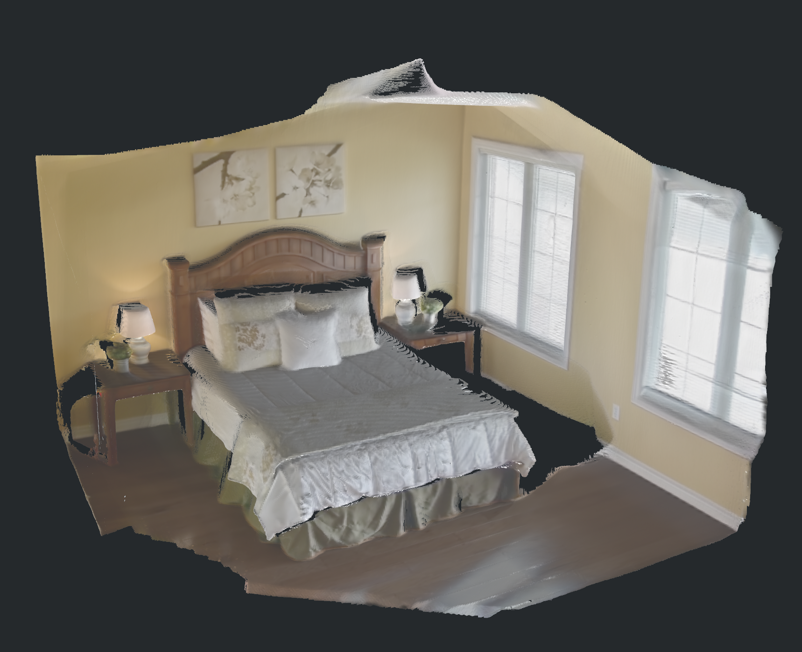

下一步 SAM3 语义可直接投影回 PGSR centers，Web 则以 scene Gaussian 为静态视觉底层、以处理后的 TSDF 为静态 collision world。门禁包括 PLY Gaussian 字段、mesh face、训练 iteration、render 指标和人工视觉检查；边缘拉丝被记录为视觉问题，不用激进裁剪破坏墙地面。

## 05. Open-vocabulary 与 SAM3：从词语到跨帧 mask

先在代表帧发现开放词汇类别，再把类别或 visual prompt 交给 SAM3，在所有帧产生 boxes、scores、masks 与 track evidence。SAM3 只给二维证据，不直接产生 3D bbox。

fresh bedroom_4 使用 GroundingDINO 固定 query bank 作为类别发现代理：9 个候选类别、8 个类别实际产生 mask，957 个 source instance masks 合并成 616 个 class-frame probability masks。这不是 Holi-Spatial 论文里的 Gemini 动态类别记忆，manifest 会保留 provider 边界。

为验证“枕头在哪里”，另行执行了隔离 pillow delta：80/80 帧、raw 293 masks；通过每帧 top-3、score `>=0.90`、5px erosion 后保留 223 个高置信实例证据，且没有覆盖 fresh run。

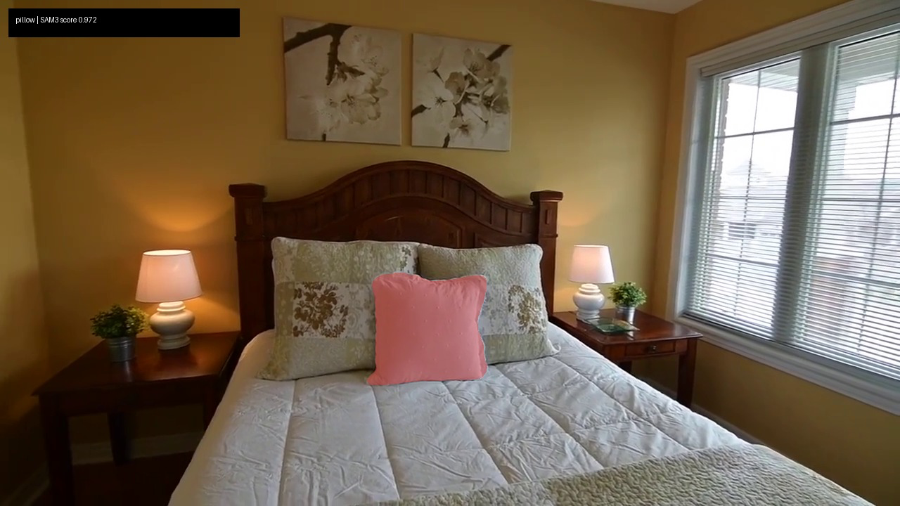

门禁：每个 mask 绑定 frame ID、prompt、score、像素尺寸与 source run；空类别、低分 mask 和跨 run 裸 ID 不得静默混用。

## 06. 多视角 Fusion：二维 mask 变成三维实例

本阶段把 mask、相机和 depth 联合起来。每个像素沿相机射线回到可见三维点，并用 mask probability、深度一致性和多视角 vote 聚合；随后用 voxel DBSCAN 拆分实例，生成对象点云、AABB/OBB，并把对象概率写回 PGSR Gaussian。

fresh 基础 run 得到 13 条 3D records：10 个前景实例和 3 个结构实例。主 semantic PGSR 保留全部 871,317 个 Gaussian，并追加 `object_id:int` 与 `object_probability:float`；8 个有效类别合计选中 701,608 个 Gaussian。当前 semantic 3DGS 是 class-level，不能把同类 lamp 自动当作稳定 instance identity。

fresh 基础融合的真实命令使用 `--min-votes 1`；旧报告生成器硬编码的“至少 2 票”不是该 run 的执行事实。下面的隔离 pillow delta 才单独使用 `min_votes=2`，两者必须按 source run 分开记录。

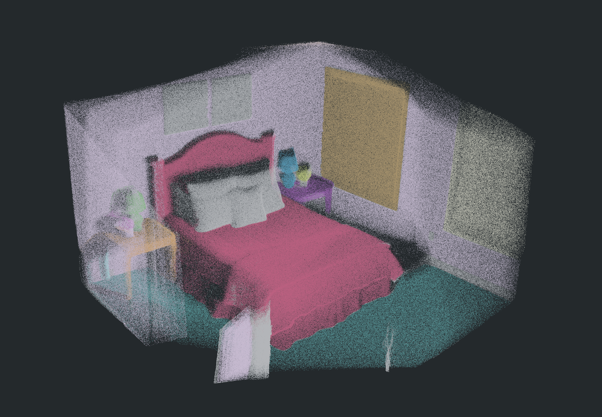


pillow delta 最初混入床头板，三视角最低投影命中率仅 `0.8796`，因此明确失败。最终采用 5px erosion、relative depth tolerance `0.005`、`min_votes=2`，得到 209,479 点的 `sam3_pillow_01`，三视角命中率 `0.9818 / 0.9863 / 0.9734`，通过 `>=0.95` 门禁。

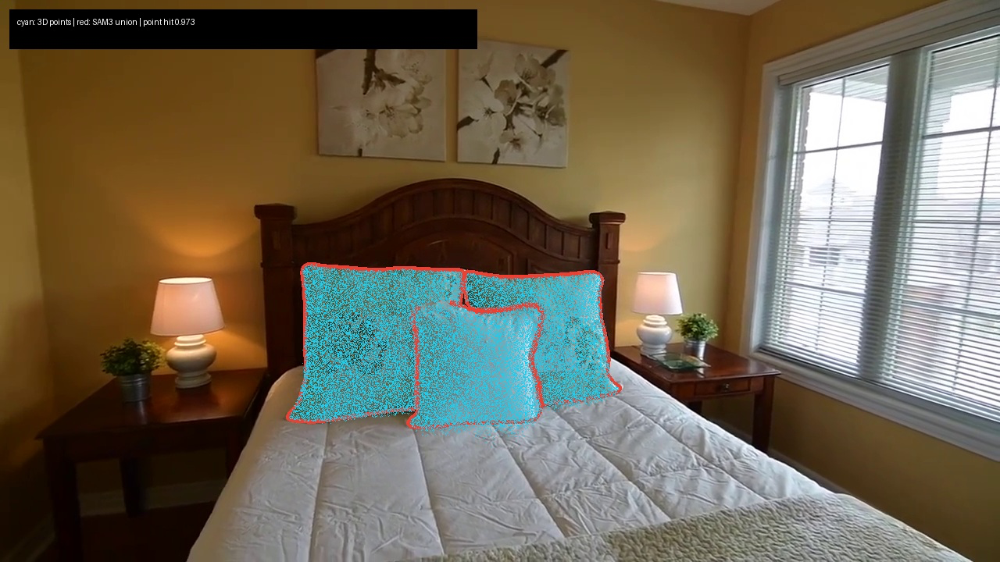

下一步 Cognition 消费 bbox/证据，Completion Plan 消费多帧身份、可见面与 OBB；后端路由通过后，具体重建器才消费最佳视角 RGBA 或多视角几何。Web 用 bbox 做 focus/highlight。未被识别或未被替换的 scene Gaussians 始终保留在静态层。

## 07. Scene Cognition：描述、关系和可审计问答

输入是稳定实例 ID、AABB/OBB、代表帧与 mask crop。输出 `object_facts`：中英名称与 aliases、详细外观描述、位置描述、`OnTopOf/SupportedBy/Near/...` 关系、证据帧和置信度。

本次 bedroom_4 使用本地 Hugging Face Transformers 运行 `Qwen/Qwen2.5-VL-3B-Instruct`，精确 revision 为 `66285546d2b821cf421d4f5eb2576359d3770cd3`。模型校验记录为 3,754,622,976 parameters、两片 safetensors 合计 7,509,245,952 bytes；`transformers 4.57.3`、`torch 2.5.1+cu124`、`bfloat16`、SDPA、RTX 3090，且 missing/unexpected/mismatched keys 与 load errors 均为零。6/6 个对象描述通过结构与证据门禁。

每条描述保留 prompt、原始模型输出、输入图、frame/mask hash 与 model revision。最终 provider 标记为 `local_huggingface_transformers+agent_visual_audit`：先由 Qwen 生成，再做显式 schema 规范化和逐图人工审计修正；它不是未经复核的纯模型原文，也不等同于 Holi-Spatial official VLM confidence agent。

几何关系由离线 scene graph 决定；VLM 只描述可见外观或润色语言，不拥有几何真值。查询 resolver 先解析 `id/name/category/alias`，同类多实例要求序号或用户选择，未知对象 fail closed。解析成功后返回稳定 object ID 与 bbox，Web 使用同一 selection API 聚焦相机并显示边界框。

例如 `枕头在哪里？` 现在解析到 `sam3_pillow_01`，回答“枕头组合位于床上”，并聚焦 accepted AABB；`枕头长什么样？` 读取有 evidence 的描述。由于本轮三个枕头相触，答案必须说明这是一个 ensemble，不能伪装成三个稳定实例。


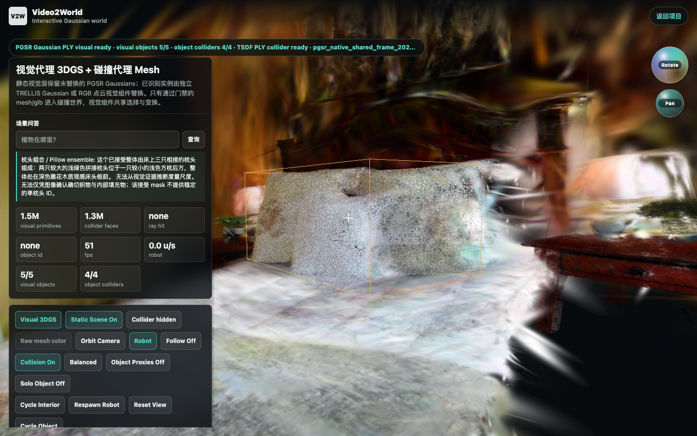

门禁：描述必须记录 provider/model/prompt/evidence；没有描述时返回“未生成”，没有 bbox 时不执行伪 focus，未公制标定时不输出米制距离。

## 08. Completion Plan：把遮挡图变成顺序化 round

`completion_plan` 联合 Inventory、SAM3、Fusion 与 Cognition，把 confident occlusion DAG 做 front-to-back topological layering。默认一轮只处理一个对象。R1 的场景输入必须是原始 RGB；R2 必须输入 R1 clean plate，R3 必须输入 R2，R4 必须输入 R3。同一对象不能被 peel 两次，前一轮没有 passed 时下一轮不能运行；不存在“先把所有对象合成一个全局 mask，再一次性补背景”的合法捷径。最后一轮固定为 `final_background`。

每个 object round 根据 completion needs 组合 `split_instances`、`segment`、`lift_to_3d`、`complete_object`、`build_collider`、`place_object`、`clean_plate`、`reinspect` 与 `validate_round`，并给每个 action 写 required output roles、idempotency key 和 acceptance gates。计划本身不生成资产；它只定义顺序、依赖、停止条件和失败传播。

门禁：inventory/hash 必须与 occlusion graph 匹配，图无环，round index 连续，`input_clean_plate_round=N-1`，object round 目标非空，final background 目标为空。完整 round 表见 [通用遮挡、背面与背景分层补全](completion.md)。

执行收据比计划更严格：每轮 `input_clean_plate.sha256` 必须等于上一轮 `output_clean_plate.sha256`，并且每轮都有重新 scene audit、SAM3、质量审核和新 clean plate 的内容 hash。object round 必须绑定对象补全 receipt；末轮必须是 `final_background` 并绑定 background rebuild receipt。缺少深层对象、真实背景或任一中间轮次时，`layered_completion_report` adapter 直接拒绝，不能靠首层候选或手写 status 过关。

## 09. Evidence-based Completion：mesh-first 独立物体与 clean scene

本阶段不是固定调用 TRELLIS。路由先检查同物理实例、多帧外观合同、标定视角数量、camera baseline、可见表面比例、类别先验和 CAD confidence，再依次选择直接多视角重建、柔性类别先验、CAD 检索或 generative image-to-3D。身份或外观未验证时选择 `hold_for_more_evidence`，不会为了得到一个模型而继续生成。

EmbodiedGen V2 / TRELLIS 是 generative image-to-3D 后端之一：将带 alpha 的单物体 RGBA、类别和描述送入模型，优先输出 canonical PBR GLB/mesh。该步骤可以提出扫描不可见面的候选，使对象能从场景中独立选择和旋转；它不是扫描几何的自动精确替代。后端如果同时输出 Gaussian PLY 或 point cloud，manifest 可以把它们作为可选 evidence/legacy visual 保存，但新对象不因缺少 object Gaussian 而失败。

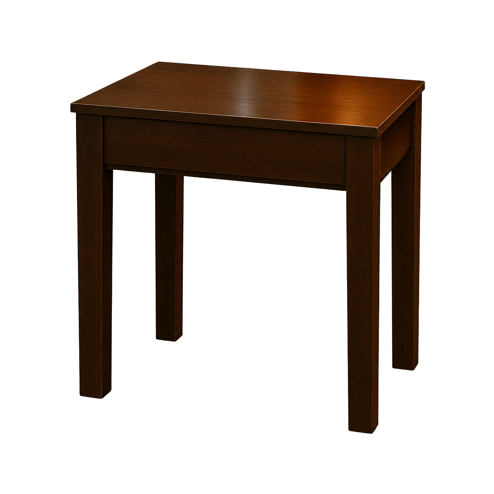

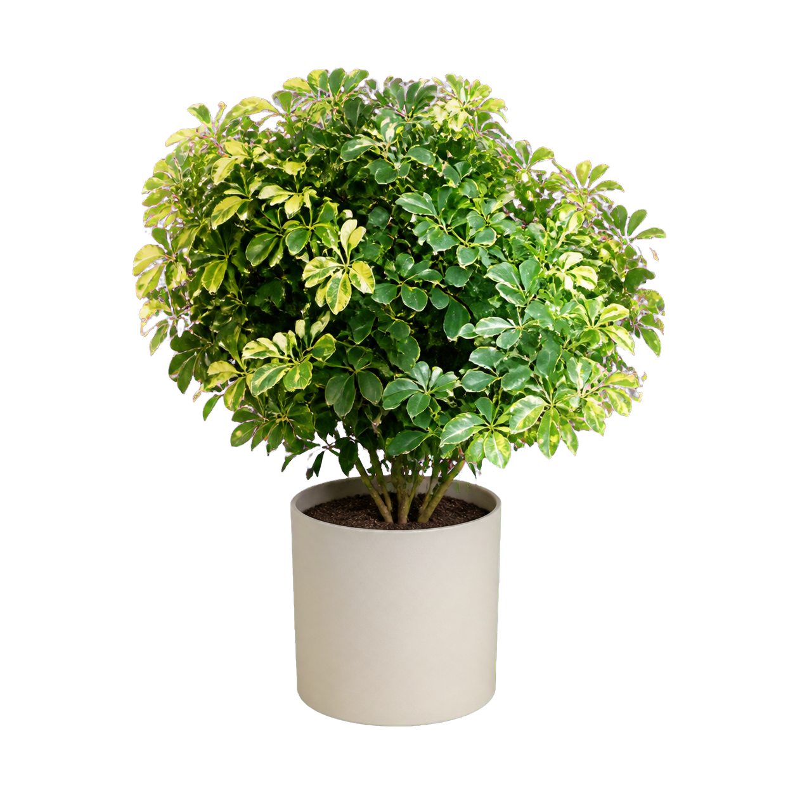

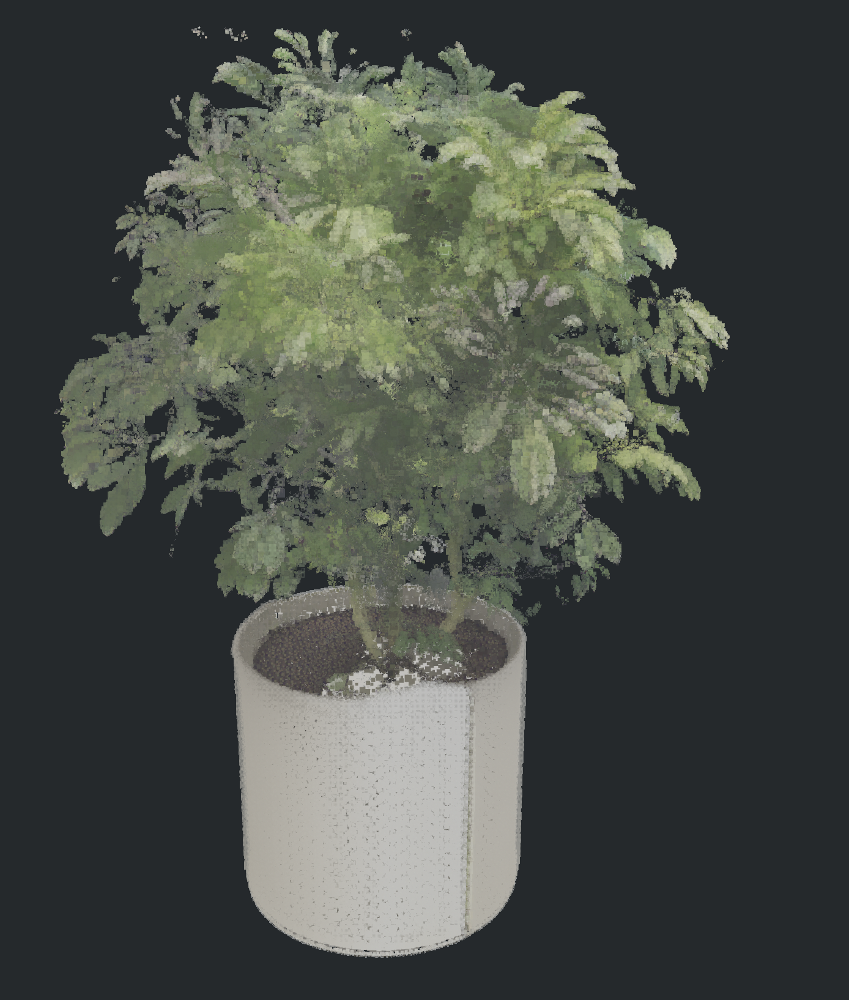

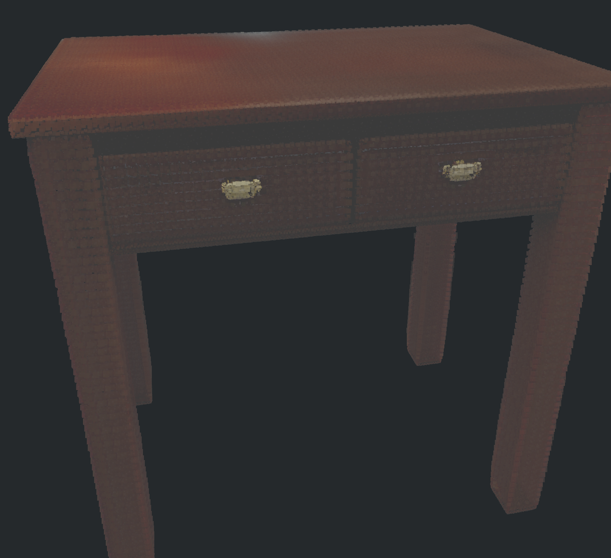

旧 production 真实归档有 9 个 final Gaussian PLY 和 9 组 GLB/OBJ。该 auto-completion 资产实际引用较早的 2026-07-13 Holi run，不是 07-14 fresh run，因此不能只凭同名 `object_id` 绑定。可接入 bedroom_4 的首批对象是经过单独 source-anchor 与 placement QA 的 `nightstand_01/02` 与 `plant_01/02`；两扇 door 因语义不符被拒绝。这个 Gaussian visual + render mesh + simplified collider 的三份资产模式保留为 2026-07-16 生产历史，不再作为新对象的默认格式。

每个候选还要分别渲染 front/right/back/left/top/bottom。确定性 gate 检查 finite、非退化、winding、厚度、front silhouette、source/front/material 色差与六视图非空；VLM 检查 identity、颜色、材质、部件布局、缺背面和跨视图风格。审核按 severity 决策：轻微不可见面纹理/材质幻觉可以 `status=passed` 并记录 limitation；明显形变、主色类别错误、缺面/片状、部件断裂、悬空或显著穿模才 retry/reject。最多三轮，第三轮仍有 blocking issue 才标为 exhausted。

旧 parametric category-prior 候选已经通过 object-only mesh/Gaussian 六视图，保留为多表示历史证据。当前 mesh-first front pillow 是真实 TRELLIS2 seed 42 PBR GLB：60,237 vertices / 97,082 faces、PBR material、finite、无退化面、winding consistent、non-watertight；六视图有完整厚度。不可见面花纹差异按用户验收属于已记录的 minor limitation，不阻断整体形状和浅色主色类别放行。它的 source-camera 回投为 mask IoU `0.709810`、bbox IoU `0.924577`、中心误差 `4.402 px`，三项技术 gate 通过。

对象候选审核后，本 stage 做 provisional scene fit 并生成 clean plate。系统同时维护两条有不同来源约束的数据流：场景底图严格使用原始 RGB -> R1 composite -> R2 composite -> R3 composite -> R4 final；measured donor 池则始终只使用原始观测 RGB-D，并按当轮累计 removal mask 排除所有已移除对象。上一轮 composite 中的生成、PBR、ProPainter 和 unresolved 像素都不能进入 measured donor。系统先用标定 donor RGB-D、z-buffer 和前景排除恢复直接可观察的背景，再只对 residual hole 使用 PBR/structural 或受约束生成；RGB 通过跨视图审核后重新估计 depth/normal，不能复用仍含前景物体的旧 depth。被替换对象必须从静态 scene Gaussian 与 scene mesh 中剔除，未识别对象保持原样。每轮结束后重新 scene audit/SAM3/depth，才能进入更深遮挡层。

当前 bedroom_4 的 ProPainter full-mask 与 donor reprojection 失败证据继续保留：保守 donor coverage 只有 `0.62% / 0.17% / 0.59%`，零 margin 约 10% 的数值实际来自前景边缘泄漏。之后 SDXL inpainting 生成三个单帧 anchor；用户已把 seed `2026071701` 以 `pass_with_known_limitation` 放行当前 demo 和对象集成 QA。该候选 mask 外 changed pixels 为 0，但移除区仍有枕头状生成，所以不证明 object-free background、跨视图一致性或遮挡床面几何。

### Bedroom4 真实 R1-R4 clean plate 与 fresh DA3/PGSR/TSDF

2026-07-17 的 bedroom_4 已真正按 `front pillow -> left pillow -> right pillow -> bed -> structural background` 执行四轮，而不是一次性抠除三个枕头和床。R2-R4 每一帧的 source RGB 都由紧邻上一轮 composite 的 SHA-256 绑定；已经 removed 的对象不能作为 downstream layer 重新出现，上一轮不是 complete partition 或仍有 unresolved pixel 时下一轮不会创建。

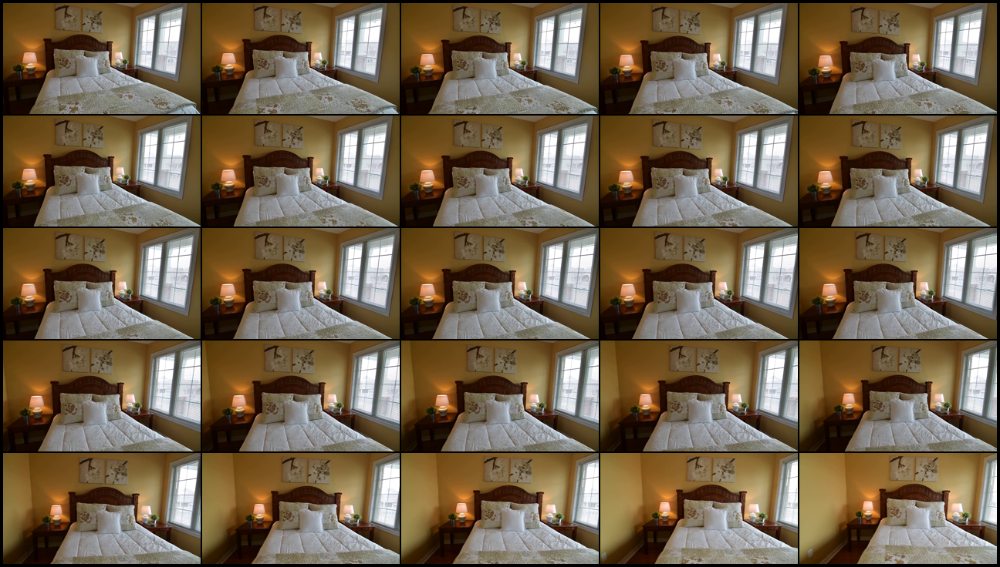

| Round | 严格场景输入 | 累计 removal mask | 原始 RGB-D donor 排除 | 独立对象产出 | 场景输出 |
|---|---|---|---|---|---|
| R1 | 原始 25 帧 | front | front | front pillow PBR GLB | R1 composite |
| R2 | 仅 R1 composite | front + left | front + left | left pillow PBR GLB | R2 composite |
| R3 | 仅 R2 composite | front + left + right | three pillows | right pillow PBR GLB | R3 composite |
| R4 | 仅 R3 composite | three pillows + bed | measured donor=0 | support-adjusted bed PBR GLB | structural background / final R4 clean plate |

因此 object completion 与 clean-scene completion 是每轮的两个不同产出：前者把当前层交付为可独立交互的 PBR GLB，后者把移除当前层后的剩余场景交给下一轮。PBR GLB 只参加遮挡分区和最终对象发布，不会被统计成 measured RGB-D donor。

R1 只移除最前面的枕头，left pillow、right pillow 与 bed 仍作为 source-camera PBR layers 参与深度分区；R2 在 R1 composite 上累计移除 left pillow；R3 再累计移除 right pillow，只保留 bed。这样每一轮 clean plate 都表示“移除当前最前层后剩余的场景”，而不是把后层对象误生成为背景。

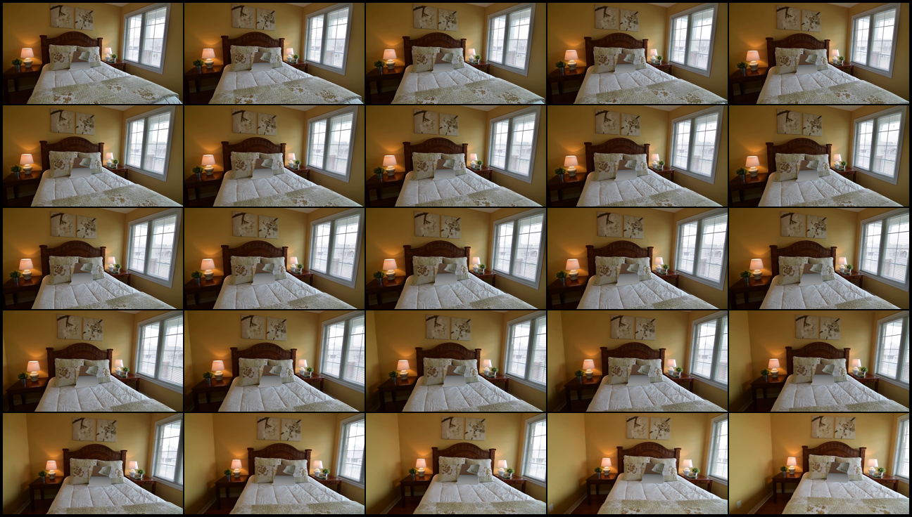

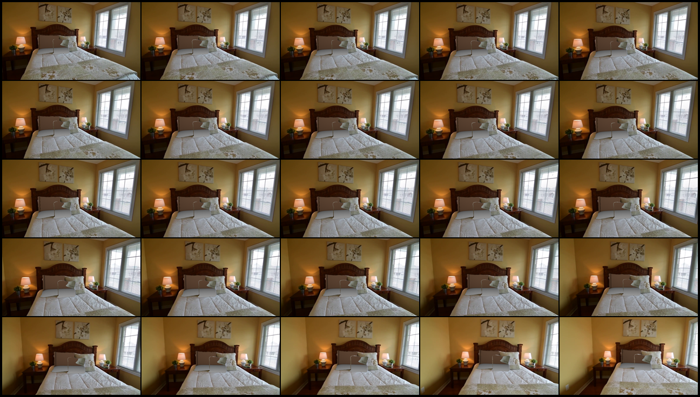

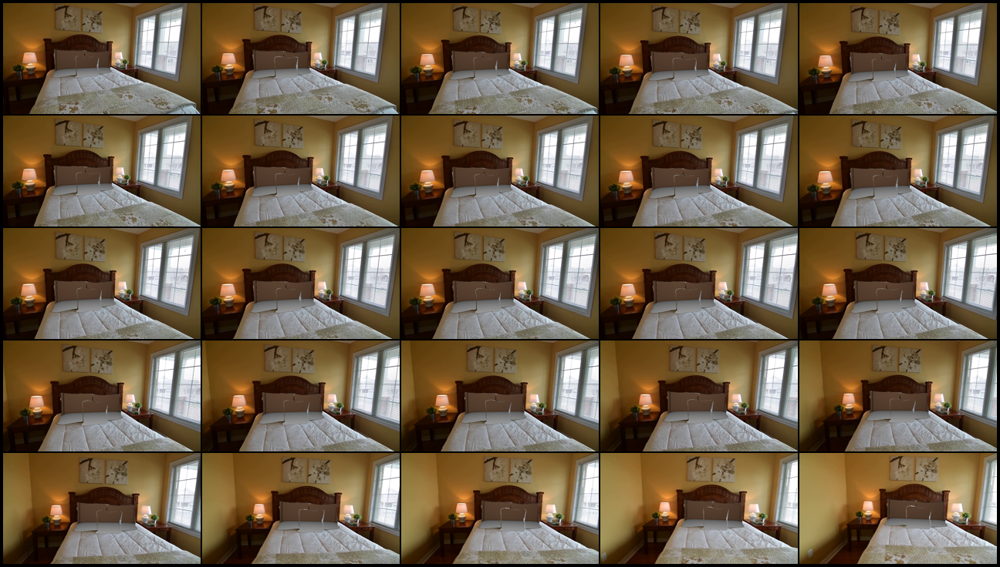

R4 以 R3 composite 为 source，再移除 bed。它没有 measured donor、没有 remaining object，累计 removal mask 全部由同一套 structural background RGBA/depth 分区覆盖。背景仍保留床形低频色块与简化平面，所以 sequence-stage report 保持 `promotion_approved=false`，禁止把 R4 RGB 直接当作发布资产；这不是通用背景补全质量证明。后续 `promoted_current_demo_only` 只在 fresh reconstruction、alignment 与 canonical Web QA 之后成立，不会把该字段改写成背景质量通过。

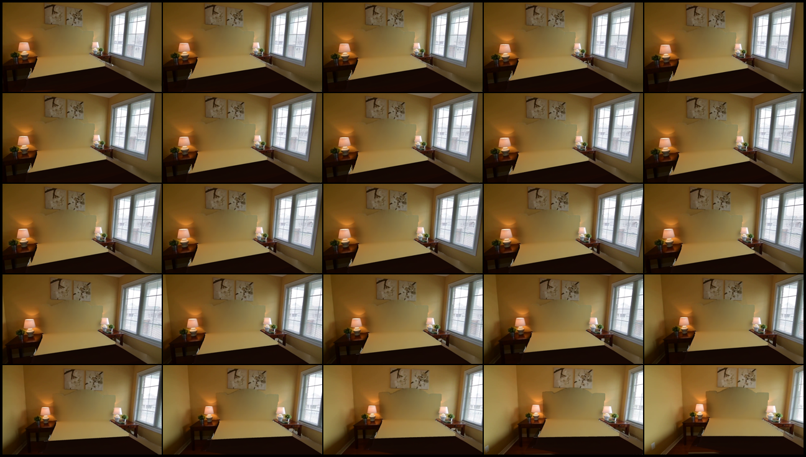

下面是四轮 report 中真实的 removal-mask pixel partition。`Measured` 只来自原始观测 RGB-D；PBR 与 structural 只填 measured residual，不能被重标成 measured donor。四轮 aggregate 与全部 25 帧都满足 `unresolved=0`。

| Round | 累计 removed | Remaining | Removal pixels | Measured | PBR render | Structural | Unresolved | Frame-set SHA-256 |
|---|---|---|---:|---:|---:|---:|---:|---|
| R1 | front pillow | left pillow, right pillow, bed | 532,888 | 69 | 532,819 | 0 | 0 | `42435b0a933078fe0b015ec32ca0d0efb4aa2829f9f69a613c8146ee8433ddd2` |
| R2 | front + left pillow | right pillow, bed | 1,233,510 | 9,669 | 1,222,217 | 1,624 | 0 | `feac1e67c06a15054ed0ff29beb279fff912421abec145e4bde6930740be17d1` |
| R3 | front + left + right pillow | bed | 1,636,824 | 12,443 | 1,622,757 | 1,624 | 0 | `e2230aa445ad049246b39049a92b53145547146d9cf1bfa05b6a43c136bd0f19` |
| R4 | three pillows + bed | none | 8,259,257 | 0 | 0 | 8,259,257 | 0 | `854bd224ab59580f6d209fbb31a50059e0075007c2f6ef0c6d98cc8fde82dfca` |

Sequence report SHA-256 是 `672ccc38d2d0187a4e99e85a1f54a451039deab5c6d73eb81f71108275483e88`，receipt SHA-256 是 `cdf2ffc02dbacf184391dafd1cd35c427fd5cf868b084548d4c7e2d7496d4d25`。机器证据还绑定四轮 manifest/report/receipt、R2-R4 predecessor、25 个 portable R4 masks、最终 frame-set 与上面的五张 contact sheet。

旧 `clean-scene-reconstruction-input-v23` 只绑定单独的 R4 背景候选，没有 R1-R4 predecessor chain。基于它启动的 PGSR 已在 4,210/30,000 主动停止，TSDF 未运行；sequence execution 将该输入标为 superseded，作废 receipt SHA-256 为 `aaf5837dc931b7d34f0097366297537358821d28a6a274fe8eb5789d4f42ce6d`，不能再进入 DA3/PGSR/TSDF 或 Web。

新的 reconstruction package 位于远端 run 的 `reconstruction/scannetppv2/data/bedroom_4`，只采用严格 R4 最终 RGB、相机子集与 transforms，不打包旧 geometry、composite depth 或 legacy DA3 depth。其 manifest SHA-256 为 `3645fc895d202d537a9104d91a21c4ff86e87352c60e3c0f118bdea06adc0299`，package receipt SHA-256 为 `33532775d7fe8c3f76724c73b13b68ab01f489d62b5742823a185d52400a468d`。

该 package 的 fresh DA3 已达到 `technical_passed_fresh_da3_current_demo_only`：25 个 depth 文件均为 `720x1280 float32`，共 23,040,000 个值，全部 finite 且为正，范围 `7.7331486..22.4680824`；`pointcloud_da3.ply` 有 4,000,000 vertices、60,000,181 bytes，XYZ 全 finite 且 4,000,000 点非零，bbox extent 为 `[26.352661, 17.238593, 16.871765]` scene units。DA3 stage receipt SHA-256 为 `287fc496a1bdfc8a44cbd36ab913da8a9263413af8631eccb7c89019352af230`，PLY SHA-256 为 `196d170d95404976b0a56ba41654cc23c71cc248955f8fc109a14f10b8ac58d3`。

PGSR 已在同一 package 上完成 30,000 iterations，状态为 `technical_passed_pgsr_30000_current_demo_only`：454,617 Gaussians、112,746,547 bytes，L1 `0.0091873651`、PSNR `33.2610672 dB`、耗时 3,088.6 秒。PLY SHA-256 为 `4eeb1403194e0248f0ab4cbf206572af5bb1ece635a03775cda6e0358133c9bf`，PGSR receipt SHA-256 为 `0224cc0868e0fb03822b3f3053f414d909056bc70857e44291b9389b776f349b`。

TSDF 随后完成，`tsdf_fusion_post.ply` 有 1,805,667 vertices / 3,556,615 faces、94,989,275 bytes，bbox extent `[26.1068731, 18.3792248, 17.0562393]`，SHA-256 为 `ccd48c2376d2cc8d81b979813a09c58feb158b66a441d66512466125b0c8f344`；TSDF receipt SHA-256 为 `c45d92dcc6810034772d1f8dbb058c34424765cd3d41ad03bdfffe100acad5c2`。alignment receipt `16839c7f0897c0095bf01ada6768d60dd23f636e102e17111fbc505e8fe27d49` 的相机子集、PGSR/TSDF 共坐标和 object placement target-frame gate 全通过。以上结果只把严格链推进到 `current_demo_only`，不把 R4 低频床形色块包装成通用背景补全质量。

本地可核验入口是 `examples/bedroom4/completion/layered-peel/cumulative-rgbd-reprojection/summary.json`、`examples/bedroom4/completion/layered-peel/layered-clean-plate-sequence-v1/layered_clean_plate_sequence_report.json` 和 `examples/bedroom4/assets-local/strict-clean-scene-mirror/reconstruction/receipts/`。PGSR/TSDF 实体在同一 mirror 的 `reconstruction/pgsr_scannetppv2_all/bedroom_4/`；文档中的数值均来自这些 report/receipt，不从旧 production manifest 反推。

门禁：source RGBA/seed 与 PBR GLB 记录 hash；类别语义、canonical bounds、非空 mesh、face 数、finite/nondegenerate/winding、PBR 材质、六视图、外观和重载入均需验证。可选 Gaussian 另记 hash，不能成为 GLB 缺失时的隐式替代。clean plate 的通用强声明还必须通过 mask-outside-unchanged、cross-view consistency、revealed-background 与新 background depth/normal；scope-limited 人工放行必须同时记录 allowed scope 和 not-proven claims。

## 10. Placement：支撑、穿模与 unified GLB collision

输入是扫描对象 OBB、accepted canonical PBR GLB、支撑面和 layered completion 产出的 clean scene。本阶段固化显式 `T_scene_from_asset` 与 scene-space pivot；同一 GLB 同时作为 PBR visual、select/drag/spin 逻辑主体与 MeshBVH collision surface，outline 挂在同一父组。OBB extent 技术拟合之后，还必须在场景 overlay 中检查 support contact、对象/背景 interpenetration 和对象间穿模。

最终 placement 只能引用前一 stage 已通过的 carved visual/mesh，否则会产生视觉重影或 stale collider，机器人仍会撞到对象旋转前的位置。

新模式使用 `collision.mode=unified-glb`，manifest 中不再出现单独 `visual`、`collision.renderAsset` 或 `colliderProxy`。`surface_bvh` 要求 1-100,000 faces、finite、无退化面、winding consistent 和 passed collision gate；它允许 non-watertight mesh，但只声称表面阻挡，不声称体积或 inside/outside。`closed_volume` 额外要求 watertight。加载或 gate 失败时 fail closed，不允许 box fallback。当前 97,082-face 枕头落在 `surface_bvh` face budget 内。

门禁分为 file、semantic、alignment、visual、collision，加上 support contact 与 scene interpenetration。unified collision-enabled 对象只有全部相关项 passed 才能注册机器人碰撞；轻微外观幻觉可以作为 passed limitation，但悬空/显著穿模仍会阻断。旧 production 的 visual-only 或 `degraded-box` 记录继续用于历史兼容，不是新对象失败后的 fallback。

## 11. World Bundle：把来源和质量写进资产

Video2World 用 `world-manifest-1.0.0` 连接各层。scene 继续记录 PGSR visual、TSDF collider 与 semantic visual；object 记录 scoped identity、描述、证据、bbox/OBB、必需 render mesh、可选 Gaussian visual、collider、变换、关系、交互策略和质量门禁。统一模式下 canonical `render_mesh` 与 `collider` 可指向同一 PBR GLB 的同一 hash，Web 投影再折叠为一个 `collision.asset`；每个本地资产都有 SHA-256 与字节数。

对象主键是 `world_id::source_run_id::object_id`。fresh Holi 与较早 EmbodiedGen 的同名对象不会只凭裸 ID 自动绑定。CLI 的 `validate` 会重新计算本地资产 hash；`adopt-existing` 只登记真实上游产物，不复制、不伪造外部执行。

每个 stage 同时写内容寻址 state：输入 hash、配置 hash、输出 hash、命令、时间、状态与日志。输入或输出变化后，下游自动变 stale；长任务可以从最近的真实成功阶段恢复。

## 12. Web Runtime：视觉、碰撞、机器人和问答共存

Web 以稳定提交 `252a85c` 的相机、坐标、机器人 spawn 与 PGSR/TSDF 对齐为 fixture，再迁移 `a5af3ae` 的静态 carve、对象父组与双击旋转。Spark 继续渲染 scene PGSR Gaussian；新独立对象由 Three.js 一次加载 PBR GLB，并用同一 mesh 承担可见表面、选择/旋转和 MeshBVH character surface collision。

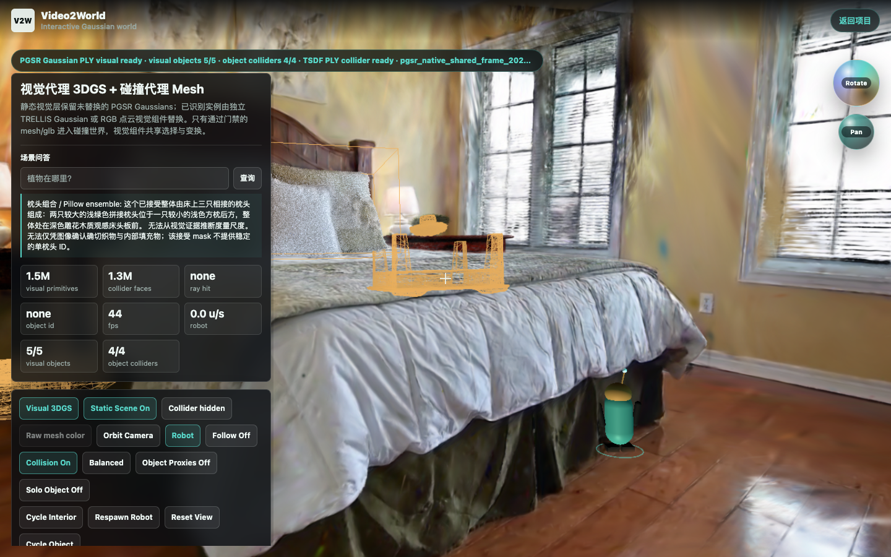

用户左键命中对象后横向拖拽，父组绕 scene-space pivot 旋转；unified 模式只变换同一个 GLB，旧模式则保持 Gaussian 与 GLB/collider 同步。双击执行 360 度并回到起始 quaternion。点击背景仍控制相机。问答输入会阻止 WASD/Space 事件传播，避免打字时机器人移动。

2026-07-16 旧 production Chrome QA 已通过：四个 TRELLIS 对象先把 static PGSR 从 871,317 carve 到 850,122，再由 accepted pillow 最近邻保守 carve 26,731 个 Gaussian，保留 823,391 个 static Gaussians；叠加 480,000 个 object Gaussians 与 209,479 个 pillow RGB points，总计 1,512,870 个视觉 primitives。carved static TSDF 为 1,265,671 faces，四个 simplified GLB collider 共 67,660 faces，4/4 加载为真实 GLB、`degradedCount=0`。静态 TSDF carve 从原 mesh 移除 85,783 faces，四个碰撞替换区残留相交面为 0。这些数字只属于旧多表示模式，不是 unified PBR GLB 的浏览器验收结果。

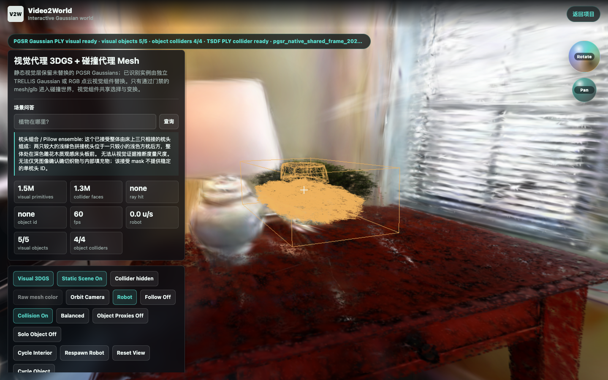

交互门禁实际执行了 `plant_01` 双击 360 回位、`nightstand_01` pointer drag、枕头 point visual + selection bbox 联动拖拽与 360 回位，以及四个 GLB 对象各自的机器人 BVH blocking probe；枕头 location/appearance query 均解析并聚焦 `sam3_pillow_01`。最终 portable-manifest 回归的 5 个 FPS sample 为 `42 / 43 / 40 / 38 / 38`，平均 40.2、最低 38；console messages、page errors 与 request failures 均为 0。生产报告同时通过 asset hash、static visual/collider carve、object collision technical QA、browser placement、cognition 与 pillow visual interaction gate。

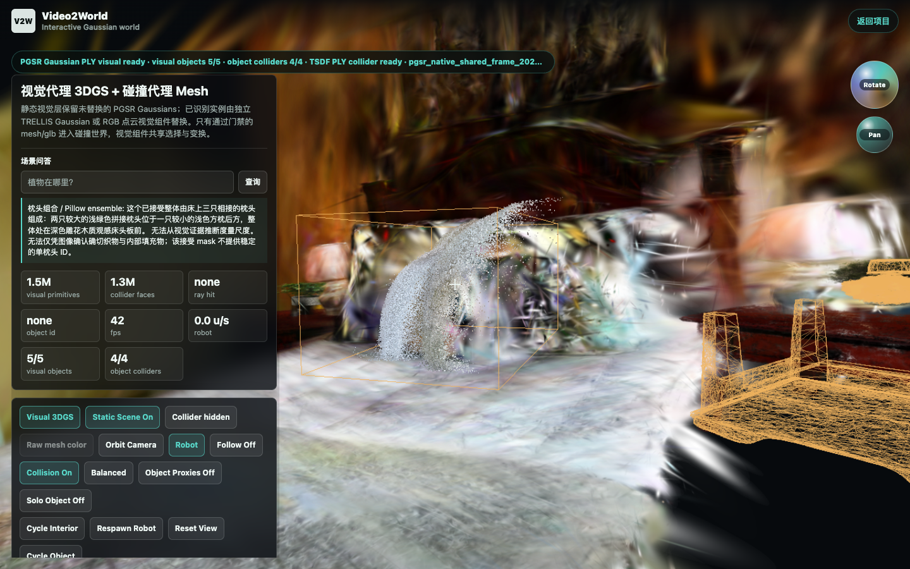

运行时仍显式报告 `sceneReady`、每个对象 collider mode/face 数、BVH target、FPS、选中 object ID 与 degraded count。旧 production 大资产报告同时记录 Chrome 1440×900 与 `390x844` fresh-load：移动端长描述换行、canvas/HUD 尺寸、水平溢出和控件不重叠均通过。

### Canonical strict clean scene Web：promoted current-demo-only

严格 clean scene 与四个 unified PBR objects 已进入 canonical `web/public/worlds/bedroom4/manifest.json`，manifest SHA-256 为 `58cc2b06ec1a7feb70fc0e0060078e0e0e1db409f3e96843c53948c74d3ab7cb`。final QA report `qa/clean-unified-scene-browser-qa.final-promoted.json` 的 SHA-256 为 `0dc5f2b312e6bef0e272920169993d2485c9e967dec596db047bedd95aa7b961`，状态 `passed_current_demo_only`、automated gate passed、`failures=[]`，manifest 请求返回的也是这组精确 bytes。

QA 与发布是两个步骤：QA report 记录 `publishingPerformed=false`；随后 `qa/strict-clean-scene-finalization-receipt.json` 用 same-directory atomic rename 把精确 QA 过的 manifest 移到 canonical 路径，状态 `promoted_current_demo_only`、`promotionAllowed=true`，receipt SHA-256 为 `a7a0691a0effd8898ee2e1a89b3c2a103b966b13005eed51cb52acdb8260c041`。稳定基线 `manifest.web-demo-baseline-stable.json` 没有被覆盖，SHA-256 仍为 `3805f0e5bab09add424b3b78f9349cd2eca6d1262777ef683e13cda07695e82b`。

| Viewport | Initial FPS | 5-sample performance | Bed overview coverage | Runtime readiness |
|---|---:|---|---|---|
| Desktop 1440x900 | 57 | `60/58/51/49/56`；平均 54.8、最低 49 | width 0.3338 / height 0.4027 | 8/8 visual、8/8 colliders、degraded=0 |
| Mobile 390x844 | 60 | `60/60/60/60/60`；平均/最低 60 | width 0.6840 / height 0.2099 | 8/8 visual、8/8 colliders、degraded=0 |

两端 `cameraInsideInteractiveObjectIds=[]`，console messages、page errors、request failures 与 HTTP errors 都为空；四个新 GLB 在各 viewport 都只请求一次。

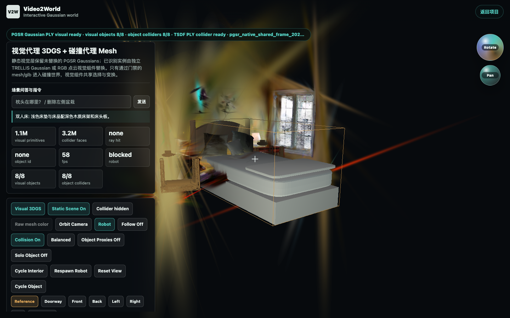

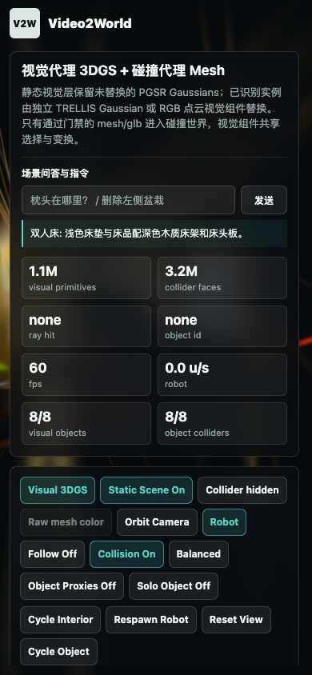

这次 promotion 证明的是 exact manifest、对象资产、统一 visual/logic/collision、相机 framing、问答和桌面/移动运行合同。R4 背景仍有明显低频拉伸、床形色块与简化平面，部分视觉只是结构代理；所以状态必须保持 `current_demo_only`，不能写成高质量 clean plate 或通用背景补全完成。

## 完成口径

一个 PLY 能打开、一个 GLB 能加载或一个网页能显示，都不等于 pipeline 完成。正式完成至少要求：

1. 场景 visual/collider/semantic 三层 hash 可验证；
2. 交互对象拥有稳定 ID、扫描证据、caption、bbox、PBR GLB 与显式 placement；unified collision-enabled 对象的同一 GLB 必须通过 surface/volume gate；旧 visual-only 对象必须明确无碰撞；
3. 新对象的 front identity、整体形状、主色类别与六视图厚度通过审核，并在最多三次 VLM review 预算内 accept；轻微背面纹理/材质偏差可以 passed，但必须记录 limitation；
4. scene fit、支撑关系、对象间及对象/背景穿模通过；
5. clean plate 的 mask 外不变、跨视图背景语义和新 depth/normal 通过后，静态 visual 与静态 collider 才剔除被替换区域；
6. unified PBR GLB 的视觉、逻辑和 BVH 共用同一父变换，旋转无漂移；旧 Gaussian + mesh/collider 模式也必须共用父变换；
7. scene query 解析、关系答案、相机 focus 与 bbox 高亮使用同一 object ID；
8. 浏览器桌面/移动、性能、console、碰撞与交互 QA 有真实记录；
9. 所有阶段可由 hash state 恢复，所有未完成项保持 candidate/failed/not-tested。

本页同时区分两代证据：2026-07-16 的旧多表示 production 统计继续作为历史基线；2026-07-17 至 2026-07-18 的新链已经把 TRELLIS2 PBR objects、严格 `front -> left -> right -> bed` clean-plate sequence、fresh DA3、PGSR 30k、TSDF、坐标对齐和 canonical desktop/mobile Web finalization 闭合到 `promoted_current_demo_only`。稳定 alias 仍指向旧基线，未被新 canonical manifest 覆盖。R4 的低频拉伸、床形色块和简化平面仍是明确限制，因此本文不声称高质量背景补全完成。详细补全门禁见 [通用遮挡、背面与背景分层补全](completion.md)，稳定运行限制见 [bedroom_4 实测记录](../progress/bedroom4-20260716.md)。
