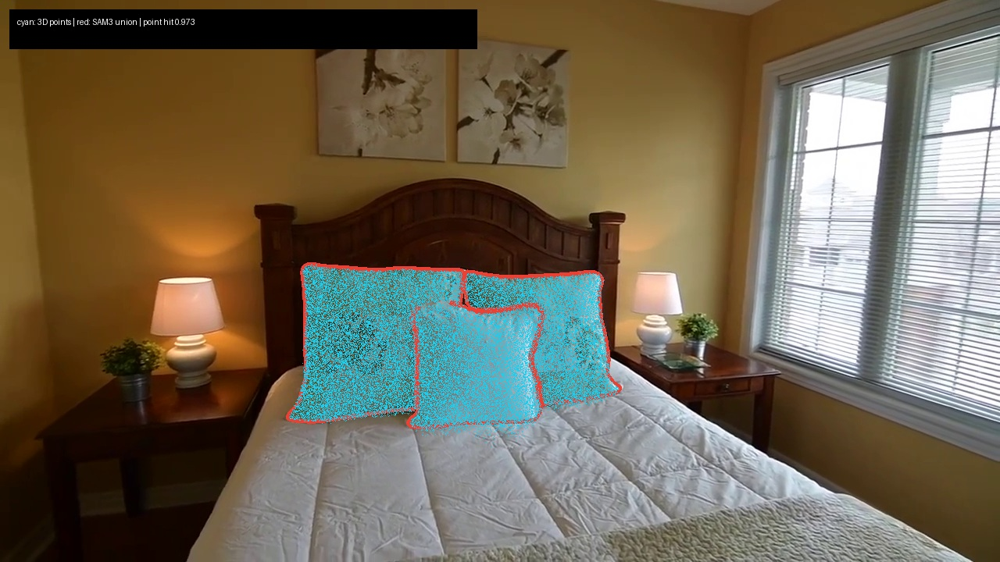
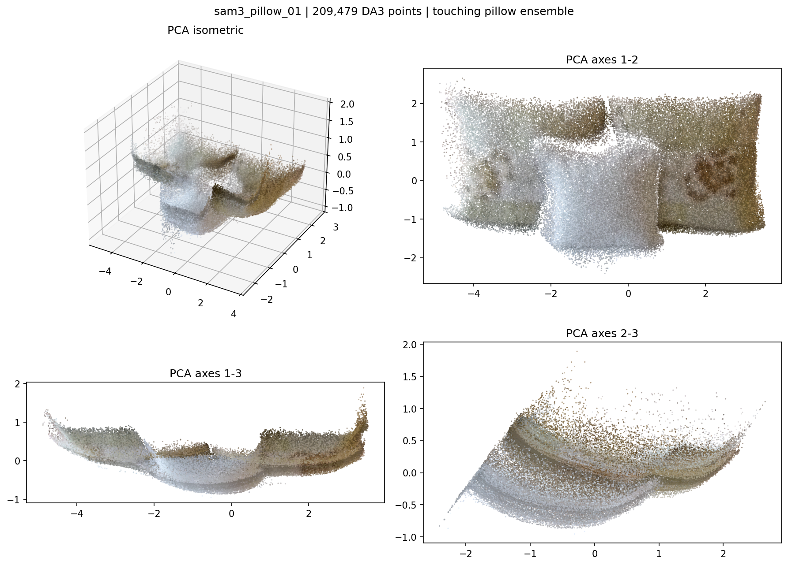

# Bedroom 4 Pillow Delta Evidence

This directory records a real, isolated SAM3 -> DA3 lifting run for the pillow category. The
authoritative Holi-Spatial fresh run remained read-only throughout.

## Remote provenance

- Read-only parent: `/data/design/zyx/workspace/holi_spatial_runs/bedroom_4_fresh_da3_sam3_pgsr_20260714_184217`
- Raw delta: `/data/design/zyx/workspace/video2world_runs/bedroom_4_pillow_delta_20260716`
- Accepted refinement: `/data/design/zyx/workspace/video2world_runs/bedroom_4_pillow_delta_20260716/refinements/top3_score090_erode5_depth005_minvotes2`
- Source frames/cameras: `/data/zyx/workspace/Video2MeshWorkspace/video2mesh_runs/bedroom_4_scene_only_v2mw_20260709_030359`
- SAM3 checkpoint SHA-256: `9999e2341ceef5e136daa386eecb55cb414446a00ac2b55eb2dfd2f7c3cf8c9e`
- DA3 point cloud SHA-256: `df4c441d233416ef2853ed4c2775ba43a80db1448d0df130c9d414c4d31cb9b1`

## What actually ran

1. The existing SAM3 checkpoint was prompted with `pillow` across all 80 source frames.
2. Raw inference produced 293 instance masks and no missing frames.
3. The raw adapter merged every same-label candidate per frame. Its 262,390-point cloud
   contained headboard geometry and failed the projection quality gate at `0.8796`.
4. The accepted refinement retained at most the top 3 candidates per frame with score >= 0.90.
   This kept 223 masks. Rank-1 scores were all >= 0.906 while rank-4 scores were all <= 0.871.
5. The accepted refinement applied a 5-pixel elliptical erosion, retained 92.18% of mask pixels,
   and lifted with `min_votes=2`, absolute depth tolerance `0.02`, and relative tolerance `0.005`.
6. Voxel DBSCAN with a 1% minimum cluster fraction retained one connected pillow ensemble.

## Accepted result

- Object ID: `sam3_pillow_01`
- Semantics: three touching pillows represented as one ensemble, not stable per-pillow tracks
- Point count: 209,479
- PLY SHA-256: `7590a8d9ae719e2af6d0017d9c1152772f99d726d414a5c4e84cb8ce017a1452`
- AABB center: `[-1.4561858416, -0.5146498406, 15.3018247366]`
- AABB extent: `[7.2625785542, 3.1900772786, 4.0793732548]`
- Projection hit ratios: `0.9818`, `0.9863`, `0.9734`
- Quality gate: passed, minimum hit ratio >= `0.95`

## Adapter status

- Official: real SAM3 runner/checkpoint and the original DA3 geometry/cameras.
- Adapter: Video2Mesh probability lifting onto DA3 points.
- Proxy: score/rank filtering, mask erosion, and voxel DBSCAN instance post-processing.
- Not run: detailed VLM caption, official Holi-Spatial QA generation, PGSR semantic projection,
  TRELLIS reconstruction, mesh/GLB export, collision QA, or metric calibration.

Coordinates are scene-scale, not meters. Web QA must not report metric distances from these
values. The accepted point cloud can be focused and rotated as one visual ensemble, but it is
not a collision asset. Use `accepted/pillow_scene_entity_candidate.json` as the Web adapter input
and `accepted/commands/run_pillow_refinement_eroded.sh` for exact reproduction.
